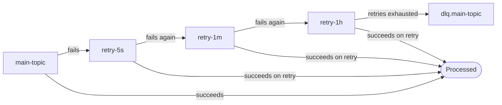

# Retry Topic Chain — Backoff Without Blocking the Partition

## Why In-Process Retry Isn't Always Enough

`consumer-groups.md`'s Application-Level DLQ Pattern retries in-process: catch, sleep with backoff, retry, and only route to DLQ once retries are exhausted. This is the right default for occasional, low-volume failures. It breaks down when failures are frequent enough that the retry loop itself becomes the bottleneck: a consumer thread blocked in a backoff sleep isn't fetching or processing anything else on its assigned partitions, so a burst of transient failures (a downstream dependency blip affecting many records at once) turns into growing lag on records that would otherwise process cleanly. In-process backoff also competes with `max.poll.interval.ms` — a long enough sleep risks the broker deciding the consumer is dead and triggering a rebalance mid-retry.

## The Pattern

Externalize retries to a chain of dedicated topics, one per backoff stage, each with its own consumer group:



A record that fails on `main-topic` is produced to `retry-5s` with headers tracking the attempt count and the earliest retry timestamp. The `retry-5s` consumer group processes that topic independently of `main-topic` — a slow or failing retry stage does not add lag to new records arriving on the main topic, because they're different topics with different consumer groups entirely. On failure again, the record moves to the next stage (`retry-1m`), with a longer backoff. After the final stage, the record goes to the DLQ, same as the in-process pattern.

**Delay implementation:** the simplest approach has each retry-stage consumer check the record's `next-retry-timestamp` header and skip (re-poll without committing) records not yet due, effectively polling until the delay elapses. This wastes some poll cycles but requires no additional infrastructure. Spring Kafka's built-in retryable-topics feature implements this pattern directly, generating topics like `main-topic-retry-1000`, `main-topic-retry-2000`, `main-topic-retry-4000` for an exponential backoff configuration, with a final `main-topic-dlt` (dead letter topic).

```java
// Header-based retry tracking, written by the failure handler
headers.add("retry-attempt", intToBytes(attempt + 1));
headers.add("retry-not-before", longToBytes(System.currentTimeMillis() + backoffMs));
producer.send(new ProducerRecord<>("retry-5s", record.key(), record.value(), headers));
```

## Tradeoffs Against In-Process Retry

| | In-process retry (`consumer-groups.md`) | Retry topic chain |
|---|---|---|
| Failure isolation | A burst of failures blocks the main partition's throughput | Main topic keeps flowing; only the retry stage absorbs the backlog |
| Operational surface | None — no new topics or consumer groups | One topic + one consumer group per backoff stage |
| Per-stage observability | Retry attempts are invisible outside application logs | Each stage's lag/throughput is independently monitorable — a stuck `retry-1h` group is a clear signal |
| Ordering | Preserved — retries happen on the same partition, in place | Not preserved across stages — a record that succeeds on retry can be processed out of order relative to records still queued on the main topic |
| Complexity | Minimal | Topic proliferation (3-4 extra topics per retryable topic), consumer group sprawl at scale |

Use in-process retry as the default (per `consumer-groups.md`). Escalate to a retry topic chain when failure rates are high enough that backoff sleeps are visibly costing main-topic throughput, or when different failure classes genuinely need different backoff schedules that are worth monitoring independently.

## Cross-References

- The in-process retry-then-DLQ pattern this escalates from — [consumer-groups.md](consumer-groups.md) Application-Level DLQ Pattern
- The other two DLQ mechanisms this pattern still terminates into — [05-Enterprise-Connect/error-handling-dlq.md](../05-Enterprise-Connect/error-handling-dlq.md), [06-Stream-Processing/windowing.md](../06-Stream-Processing/windowing.md)
- Uber's production implementation of this pattern — [Building Reliable Reprocessing and Dead Letter Queues with Apache Kafka](https://www.uber.com/en/blog/reliable-reprocessing/)
- Spring Kafka's built-in retryable-topics feature — [How the Pattern Works](https://docs.spring.io/spring-kafka/reference/retrytopic/how-the-pattern-works.html)
