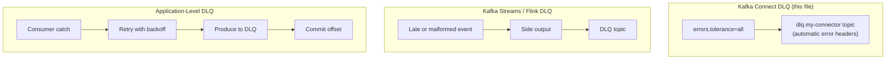

# Error Handling and Dead Letter Queues

This file covers the Kafka Connect DLQ mechanism specifically. It is one of three distinct DLQ mechanisms used across this guide, and they are not interchangeable: Connect's is framework-managed and config-driven (below); Kafka Streams/Flink route late or malformed events to a DLQ via a side output during stream processing (`06-Stream-Processing/windowing.md`); a hand-written consumer has no built-in mechanism and must implement the catch-produce-commit sequence itself (`04-Data-Consumption/consumer-groups.md`'s Application-Level DLQ Pattern section). A pipeline with multiple hops (Connect → Streams/Flink → application consumer) can use all three at different stages — confirm which one applies at each hop rather than assuming "the DLQ" is a single thing.



## Connector Failure Modes

Connect tasks fail for three distinct reasons, each requiring a different diagnostic approach:

**Serialisation errors:** the converter cannot deserialise the record from the source (for sink connectors) or cannot serialise it for Kafka (for source connectors). The most common cause is a converter mismatch — configuring `JsonConverter` on a topic that contains Avro-serialised records produces an `Unknown Magic Byte Exception`. The first byte of an Avro-encoded record is a magic byte (`0x00`) that JSON parsers do not expect.

**Transformation errors:** an SMT fails during execution — a field expected by `ExtractField` is missing, a `Cast` encounters an incompatible type, or a `RegexRouter` pattern produces an invalid topic name. These errors surface after deserialisation, so the record content is readable in the DLQ.

**Sink write failures:** the destination system rejects the record — primary key violations, type mismatches against the destination schema, network timeouts, or the downstream system being unavailable. These are the hardest to distinguish from transient infrastructure issues vs permanent data quality problems.

## Default Error Behaviour

By default, `errors.tolerance=none`: any record that causes an error fails the task immediately. The task moves to FAILED state and stops processing. No further records are consumed until the task is manually restarted. This is the correct default for catching misconfigurations early, but it is too aggressive for production pipelines where occasional bad records are expected.

## DLQ Configuration

To route failed records to a dead letter queue instead of stopping the task:

```json
{
  "errors.tolerance": "all",
  "errors.deadletterqueue.topic.name": "dlq.my-connector",
  "errors.deadletterqueue.context.headers.enable": "true",
  "errors.deadletterqueue.topic.replication.factor": "3"
}
```

**`errors.tolerance=all`** is required. Without it, errors still fail the task regardless of DLQ configuration.

**`errors.deadletterqueue.topic.name`** specifies the target topic. The topic is created automatically if it does not exist, using default broker settings — explicitly pre-create it with appropriate retention and replication if the DLQ topic is operationally significant.

**`errors.deadletterqueue.context.headers.enable=true`** injects error context into each DLQ record's headers:

| Header | Content |
|---|---|
| `__connect.errors.exception.class.name` | The exception class that caused the failure |
| `__connect.errors.exception.message` | The exception message |
| `__connect.errors.topic` | Original source topic |
| `__connect.errors.partition` | Original partition |
| `__connect.errors.offset` | Original offset |
| `__connect.errors.stage` | Where in the pipeline the failure occurred (`TRANSFORMATION`, `VALUE_CONVERTER`, `TASK_PUT`) |

Without this setting, a DLQ record contains the original key and value but no indication of why it failed — debugging becomes guesswork.

## Debugging with the DLQ

DLQ records retain the original key and value bytes exactly as they arrived. For serialisation errors, the value may not be deserialised correctly by your DLQ consumer — use a `ByteArrayDeserializer` and inspect the raw bytes alongside the header metadata.

Standard debugging workflow:

1. Consume from the DLQ topic with header inspection enabled
2. Read `__connect.errors.stage` to identify where in the pipeline the failure occurred
3. Read `__connect.errors.exception.message` for the specific error
4. For serialisation errors: verify converter configuration matches the actual topic encoding
5. For transformation errors: check that required fields exist in the record
6. For sink errors: inspect the destination system logs at the timestamp of the original record (use `__connect.errors.offset` to find the original record time)

After correcting the root cause (connector config, SMT logic, or source data), re-produce the corrected records from the DLQ back to the original input topic using a script or a dedicated repair connector. Do not produce directly to the connector's output topic — the connector's offset tracking will not reflect the reprocessing.

## Monitoring Connector Health

**Status API:**
```bash
# Overall connector status
curl http://connect-host:8083/connectors/my-connector/status

# Response shows RUNNING, PAUSED, FAILED per task
{
  "name": "my-connector",
  "connector": {"state": "RUNNING"},
  "tasks": [
    {"id": 0, "state": "FAILED", "trace": "...exception..."}
  ]
}
```

**JMX metrics to alert on:**

| Metric | Alert threshold |
|---|---|
| `failed-task-count` | > 0 (any failed task is a production incident) |
| `error-total` | Rate spike (indicates systematic bad data) |
| `transformation-time-ms-avg` | > 50ms (SMT chain bottleneck) |
| `offset-commit-failure-percentage` | > 0 (offset tracking degraded) |

**DLQ receive rate as a data quality signal:** a sudden spike in DLQ message rate that correlates with a schema change or a new data source deployment indicates a compatibility regression. Alert on DLQ topic `MessagesInPerSec` exceeding a baseline threshold — this catches issues before they propagate to downstream consumers.

## Cross-References

- DLQ as a mandatory onboarding gate for consumers — [10-Operational-Patterns/consumer-onboarding.md](../10-Operational-Patterns/consumer-onboarding.md)
- DLQ as a mandatory onboarding gate for connectors — [10-Operational-Patterns/connector-onboarding.md](../10-Operational-Patterns/connector-onboarding.md)
- Broker-side validation vs DLQ decision — [08-Stream-Governance/broker-side-validation.md](../08-Stream-Governance/broker-side-validation.md)
- CEL quality rules routing violations to DLQ — [08-Stream-Governance/data-contracts.md](../08-Stream-Governance/data-contracts.md)
