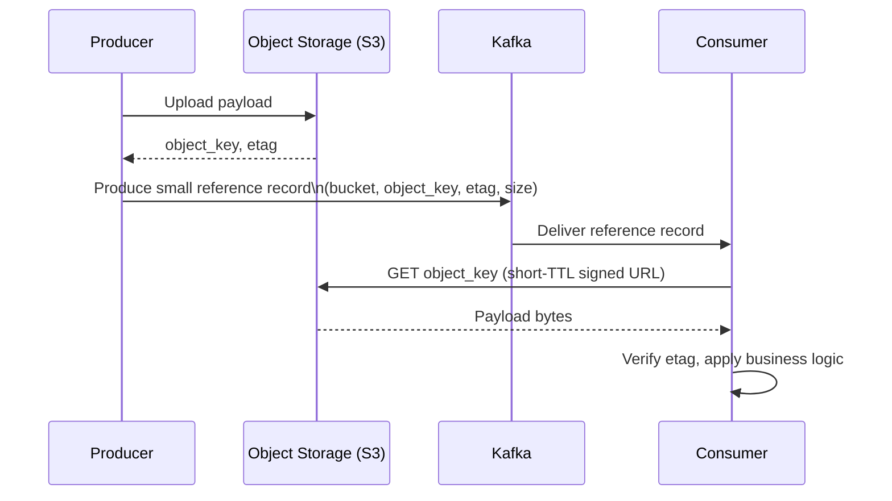

# Claim Check — Large Payloads Without Oversized Records

## The Problem

Kafka is tuned for many small-to-medium records, not a few large ones. The broker default `message.max.bytes` is 1 MB; raising it has real costs that compound across the cluster: larger records consume more page cache per record, replication copies the full payload to every in-sync replica, producer/consumer memory buffers (`buffer.memory`, `fetch.max.bytes`) must grow to match, and a batch containing one oversized record blocks smaller records behind it in the same partition. This is a broker-wide, cluster-wide tuning change to accommodate what is usually a small fraction of records — images, PDFs, large JSON payloads, ML model artifacts, video frames.

## The Pattern

Store the payload in object storage (S3, GCS, Azure Blob) and publish a small reference record to Kafka instead of the payload itself:

```json
{
  "key": "order-48213",
  "value": {
    "bucket": "payload-store-prod",
    "object_key": "orders/2026/07/order-48213-a1b2c3.bin",
    "etag": "9e2b1f...",
    "size_bytes": 4823110,
    "content_type": "application/pdf",
    "schema_version": 1
  }
}
```

Consumers fetch the object from storage on demand using the reference, verify the `etag` against what they retrieve (catches a stale or corrupted object), and apply business logic against the fetched payload. The Kafka record itself stays small regardless of the actual payload size — replication, page cache, and consumer fetch behavior are unaffected by payload growth.



## Object Storage Reference, Not a Signed URL

Put a stable object key in the Kafka record, not a long-lived pre-signed URL. A signed URL embedded in a record is a durable credential sitting in Kafka's replicated log, retained for as long as the topic's retention policy — anyone with read access to the topic (or its DLQ, or a downstream sink) gets standing access to the object for the URL's validity window, and that window frequently outlives the intended use. Sign URLs at read time with a short TTL, scoped to the specific consumer resolving the reference, rather than embedding a signed URL in the produced record.

## When to Use It

- Payloads consistently or occasionally exceed the practical broker/producer/consumer size budget (as a rule of thumb, more than a low single-digit percentage of `message.max.bytes`)
- The payload is opaque to the streaming platform — Kafka doesn't need to inspect, filter, or transform the payload's contents, only route a reference to it
- Storage cost matters: object storage is materially cheaper per byte than broker disk + replication factor + page cache pressure for the same bytes

## When Not to Use It

- Payloads comfortably fit within normal record sizes — this pattern adds an object-storage round trip and a second system to operate for no benefit
- The payload's fields are needed for stream processing (filtering, joins, aggregation) — a reference-only record forces every processor to fetch the full object before it can do anything, which defeats the purpose of using a stream processor in the first place. In that case, either the payload belongs in the record directly, or the processor should key off a smaller, already-referenced summary field alongside the claim check
- Strict end-to-end latency budgets — the additional object storage GET adds a network round trip most low-latency pipelines can't absorb

## Cross-References

- Confluent's own reference description of this pattern — [Claim Check](https://developer.confluent.io/patterns/event-processing/claim-check/)
- Broker-side size limits this pattern works around — `13-Performance-Tuning/broker-tuning.md`
- Object storage as a sink for the payload itself, if the payload's destination is ultimately a data lake rather than a live consumer — `01-Core-Concepts/kafka-vs-confluent.md` (Tableflow/Iceberg materialization)
