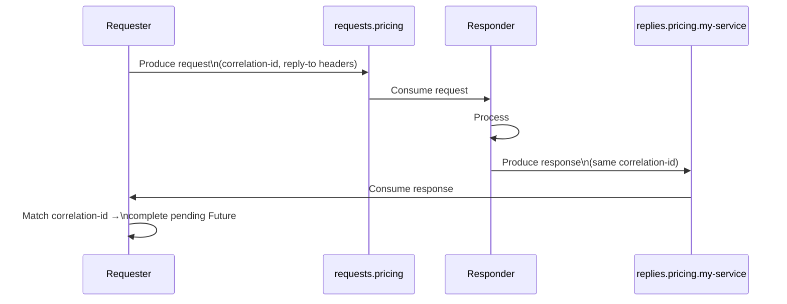

# Request-Reply Over Kafka — And When Not to Build It

## The Pattern

A requester needs a synchronous-style response to a specific request, but the system already runs on Kafka as its backbone. Rather than adding a second transport (gRPC, REST) purely for this one interaction, request-reply can be built directly on top of existing topics:

1. The requester generates a **correlation ID** (a UUID) and produces a request record to a request topic, with the correlation ID and a reply-to topic name in headers.
2. The responder consumes the request topic, processes it, and produces a response record to the reply-to topic, carrying the same correlation ID in its headers.
3. The requester runs a dedicated consumer on its reply-to topic. As responses arrive, it reads the correlation ID from the headers and completes the matching pending request (typically an in-memory map of correlation ID → pending `Future`/callback).
4. Requests that never receive a response within a timeout window are failed client-side — Kafka gives no built-in request/response coupling, so the timeout and cleanup of the pending-request map is entirely the requester's responsibility.



```java
String correlationId = UUID.randomUUID().toString();
ProducerRecord<String, byte[]> request = new ProducerRecord<>("requests.pricing", key, payload);
request.headers().add("correlation-id", correlationId.getBytes());
request.headers().add("reply-to", "replies.pricing.my-service".getBytes());
CompletableFuture<byte[]> pending = new CompletableFuture<>();
pendingRequests.put(correlationId, pending);
producer.send(request);
byte[] response = pending.get(timeout, TimeUnit.SECONDS); // times out if no reply arrives
```

## When This Is the Wrong Tool

**Latency-sensitive point-to-point calls.** A Kafka round trip (produce → broker → consume → process → produce → broker → consume) adds tens of milliseconds of overhead beyond what a direct gRPC or HTTP call incurs. If the interaction is a simple synchronous call between two services that both have direct network reachability, a dedicated RPC transport is simpler to operate and faster.

**The interaction isn't otherwise event-driven.** If nothing about the request or response needs to be durably logged, replayed, or consumed by anything other than the original requester, introducing Kafka adds topic and consumer group management overhead for what is fundamentally a two-party synchronous call. Don't add Kafka to a codebase purely to get request-reply — this pattern is for systems that already have Kafka as their backbone for other reasons.

**Requests need strict 1:1 pairing under high volume.** At high request rates, the requester-side correlation map, per-request timeout tracking, and dedicated reply-topic consumer become their own operational surface — a component the requester must scale and monitor independently of its normal produce/consume paths.

## When It's the Right Tool

- The requester and responder are already decoupled services that communicate exclusively through Kafka, and direct network reachability between them isn't guaranteed or desired (e.g., different trust zones, different clouds, only Kafka is the shared dependency)
- The request itself is valuable as a durable, replayable event independent of getting a reply — an audit trail of every request, not just its outcome
- The responder already processes the same topic for other (asynchronous) purposes, and adding a reply is a marginal addition rather than a new integration

## Cross-References

- Confluent's own catalog naming for this pattern (Command / Correlation Identifier) — [developer.confluent.io/patterns](https://developer.confluent.io/patterns/)
- Choosing Kafka Connect vs. direct producer/consumer for a given integration in the first place — [connect-vs-flink-framework.md](../connect-vs-flink-framework.md)
- If the actual need is keeping a database and Kafka consistent rather than synchronous RPC — [transactional-outbox.md](transactional-outbox.md)
