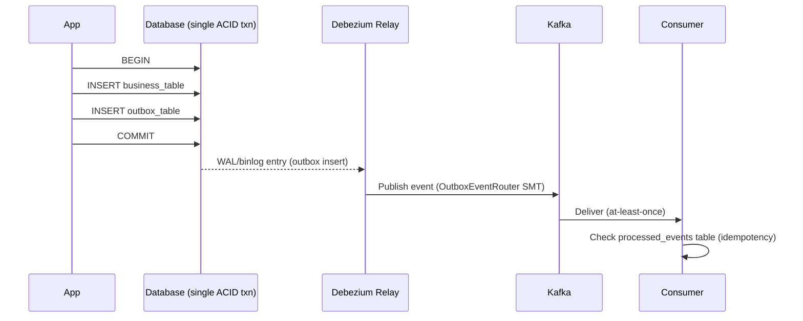

# Transactional Outbox — Reliable Database-to-Kafka Delivery

## The Dual-Write Problem

When an application must update a database and publish an event to Kafka as part of the same logical operation, naive sequential writes create two failure modes:

**Database succeeds, Kafka fails:** The application commits the database transaction, then crashes or loses network connectivity before publishing the Kafka message. Downstream consumers never learn of the change. The database and the event stream are now permanently inconsistent — the divergence is silent.

**Kafka succeeds, database fails:** The application publishes to Kafka first, then the database transaction rolls back (constraint violation, deadlock, timeout). Downstream consumers process a phantom event for a state transition that never occurred in the source system.

Both modes stem from the same root: two independent systems with no shared transaction boundary. Distributed two-phase commit across a relational database and Kafka is theoretically possible but prohibitively expensive in practice. The transactional outbox pattern solves this without 2PC. Confluent's own pattern catalog names the naive dual-write anti-pattern this section describes "Database Write Aside."

## The Outbox Pattern

The application writes its business state change and a structured event record into a dedicated **outbox table** within a **single local ACID transaction**. Because both writes share one transaction, they are atomically consistent — either both commit or neither does.

A separate relay process reads committed outbox rows and publishes them to Kafka. The relay is independent of the application; it cannot introduce the dual-write failure modes because it only reads from the database.



**Outbox table schema:**

```sql
CREATE TABLE outbox (
  sequence_id   BIGSERIAL PRIMARY KEY,        -- strict ordering, not timestamp
  aggregate_id  UUID         NOT NULL,        -- entity identity for partitioning
  aggregate_type VARCHAR(128) NOT NULL,        -- e.g. 'Order', 'Payment'
  type          VARCHAR(128) NOT NULL,        -- e.g. 'OrderPlaced', 'PaymentFailed'
  version       INT          NOT NULL,        -- schema version for the event type
  partition_key VARCHAR(256),                 -- override routing key if needed
  payload       BYTEA        NOT NULL,        -- serialized Avro or Protobuf
  created_at    TIMESTAMPTZ  DEFAULT NOW()
);
```

Key design choices:
- **`sequence_id` (BIGSERIAL):** System timestamps are unreliable under concurrent commits — two transactions that overlap can produce events with inverted timestamps. `BIGSERIAL` provides a monotone ordering that survives concurrent inserts.
- **`payload` as Avro/Protobuf, not JSON:** Serializing in the application before inserting means Schema Registry validation occurs inside the local transaction. A schema violation fails the business transaction; it cannot produce an invalid record in the outbox. If the application inserts raw JSON and lets the relay handle conversion, a malformed record can stall the entire relay pipeline.
- **`aggregate_id` as partition key:** Routes all events for the same entity to the same Kafka partition, preserving per-entity ordering.

## CDC-Based Relay

Two relay strategies exist. The polling publisher queries the outbox table on a timer and publishes new rows to Kafka. It works but adds database query load proportional to polling frequency and introduces latency proportional to the polling interval.

The production approach uses log-based **Change Data Capture** via Debezium. Instead of querying the table, Debezium reads the database's transaction log (WAL for PostgreSQL, binlog for MySQL) and captures outbox inserts as they are committed. This is zero-overhead on the query planner and sub-second latency. See `10-Operational-Patterns/cdc-debezium.md` for the Debezium architecture.

**Outbox Event Router SMT:** Debezium provides a built-in Single Message Transform called `OutboxEventRouter` that extracts the payload from the outbox row and routes it to the correct Kafka topic based on `aggregate_type`. The message key is set from `aggregate_id` or `partition_key`, preserving per-entity ordering on the topic.

```json
{
  "transforms": "outbox",
  "transforms.outbox.type": "io.debezium.transforms.outbox.EventRouter",
  "transforms.outbox.route.by.field": "aggregate_type",
  "transforms.outbox.table.field.event.key": "aggregate_id",
  "transforms.outbox.table.field.event.payload": "payload"
}
```

## Delivery Guarantee and Consumer Idempotency

The outbox pattern with CDC provides **at-least-once delivery**. If the relay publishes an event and crashes before recording its log position, it will re-read from the last committed offset and re-publish the event on restart. The event appears in Kafka twice.

Exactly-once delivery across heterogeneous systems (relational database + Kafka) is not achievable without distributed coordination that reintroduces the complexity the pattern is designed to avoid. Consumers must be idempotent.

**Idempotency via tracking table:**

```sql
CREATE TABLE processed_events (
  event_id    UUID PRIMARY KEY,
  processed_at TIMESTAMPTZ DEFAULT NOW()
);
```

On consume, the consumer inserts the event's sequence_id or a UUID derived from it into the tracking table in the same transaction as its business state update. A duplicate event produces a primary key conflict that the consumer catches and discards.

## Outbox Table Maintenance

Outbox rows that have been published to Kafka are no longer needed. Without cleanup, the table grows unboundedly.

Options:
- **Delete SMT:** Configure Debezium with the `EventRouter` in delete mode — after capturing an insert, emit a tombstone delete for the row. PostgreSQL then reclaims the space via autovacuum.
- **Partition truncation:** Partition the outbox table by time (e.g., hourly). After the relay confirms a partition is fully consumed, truncate the partition — instant, lock-free reclamation.
- **Scheduled DELETE:** `DELETE FROM outbox WHERE created_at < NOW() - INTERVAL '1 hour'` on a cron. Simple but generates WAL for each deleted row and triggers autovacuum.

## When to Use the Outbox Pattern

**Use the outbox pattern when:**
- The event must reflect a committed database state — financial transactions, order state changes, inventory updates
- Downstream consumers make irreversible decisions based on the event
- Regulatory or audit requirements demand that every state change is traceable as an event

**Skip the outbox pattern when:**
- Events are stateless and retryable (telemetry, logging, non-critical activity tracking) — direct Kafka writes with best-effort delivery are sufficient
- The application uses Event Sourcing, where the event log is the primary store and the database is a projection — the outbox is redundant because the event is already the source of truth
- State divergence is acceptable and reconcilable — some domains can tolerate eventual correction without the infrastructure overhead of CDC
