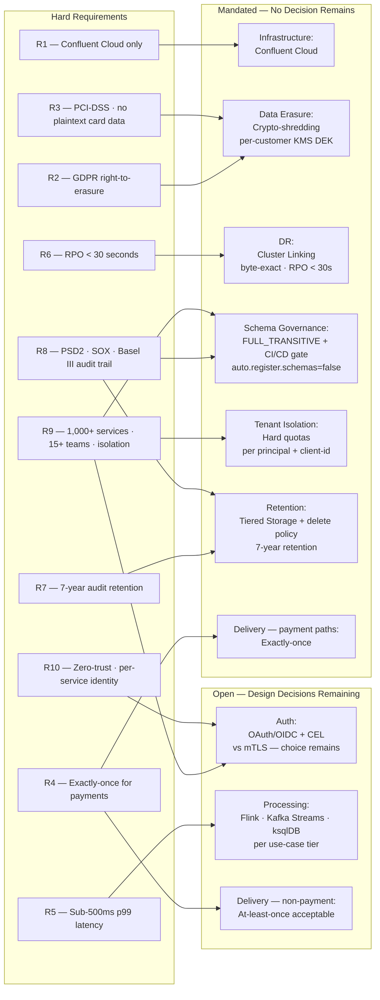
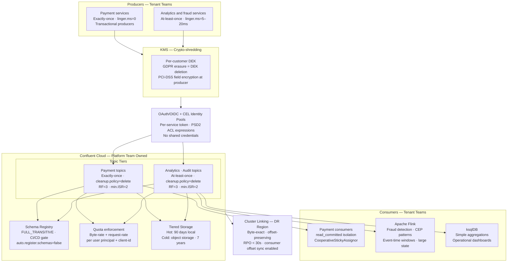
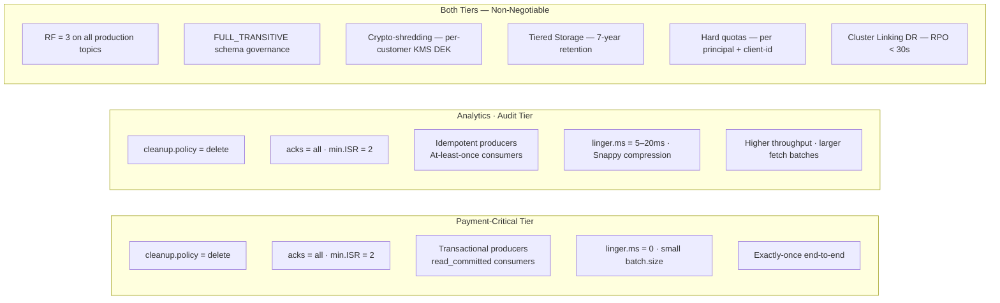

# Enterprise Banking Data Streaming Platform — Framework Design Run

A tier-1 bank standardising all real-time data movement onto a single Confluent Cloud platform. This case study walks the full problem through the [decision framework](../decision-framework.md) — extracting hard requirements, applying them as filters across all nine solution dimensions, arriving at a mandated foundation, and resolving the remaining open decisions. The design process is the point: showing how requirements collapse the solution space before any tradeoff discussion begins.

## Problem Statement

- **Scale:** 1,000+ microservices as producers and consumers; 100+ developers across 15+ product teams with independent release cycles
- **Regulatory scope:** PSD2, GDPR, Basel III, SOX, PCI-DSS
- **Latency SLA:** Sub-500ms p99 for payment authorisation and fraud signals end-to-end
- **Delivery SLA:** Exactly-once for payment events — double-credit or double-debit is a regulatory failure
- **DR SLA:** RPO < 30 seconds — a regional failure must not lose more than 30 seconds of data
- **Retention:** 7-year audit log retention
- **Security:** Zero-trust — every service identity authenticated individually; no shared credentials
- **Isolation:** A misbehaving producer from one team must not starve payment processing consumers
- **Volume:** ~500M events/day at peak; 10x burst during market open/close

## Hard Requirements

| ID | Requirement | Class |
|---|---|---|
| R1 | Confluent Cloud only — no self-managed brokers | Infrastructure |
| R2 | GDPR right-to-erasure — customer PII erasable on request without rewriting topics | Compliance |
| R3 | PCI-DSS — card data never in plaintext on the broker | Compliance |
| R4 | Exactly-once for payment events | Delivery |
| R5 | Sub-500ms p99 latency — payment authorisation and fraud signals | Latency SLA |
| R6 | RPO < 30 seconds | DR SLA |
| R7 | 7-year audit log retention | Regulatory |
| R8 | PSD2 / SOX / Basel III — immutable, auditable event trail | Compliance |
| R9 | 1,000+ services, 15+ independent teams — misbehaving producer cannot starve payment pipeline | Scale / isolation |
| R10 | Zero-trust — every service identity authenticated individually | Security |

## Requirement → Selection Map

Each requirement is a filter on the solution space. The diagram below shows which requirements drive which mandated selections, and which dimensions remain open after all filters are applied.

## Filter Pass — All Nine Dimensions

### Infrastructure

R1 eliminates every non-cloud option.

| Option | Verdict |
|---|---|
| OSS Kafka self-managed | Eliminated — R1 forbids self-managed |
| Confluent Platform self-managed | Eliminated — R1 forbids self-managed |
| **Confluent Cloud** | **Survives** |
| Hybrid | Eliminated — R1 forbids any on-prem component |

**MANDATED: Confluent Cloud.**

### Delivery Guarantee

R4 eliminates at-most-once and at-least-once on payment paths. Non-payment flows have no exactly-once requirement — delivery is an OPEN dimension for those.

| Option | Payment paths | Non-payment paths |
|---|---|---|
| At-most-once | Eliminated — R4 | Eliminated — any data loss is unacceptable |
| At-least-once | Eliminated — R4 | **Survives** |
| Exactly-once | **Survives** | **Survives** |

**MANDATED: Exactly-once on payment paths. OPEN: at-least-once acceptable for fraud signals, analytics, notifications.** This splits by topic tier, not globally — see Topic Tier Model below.

### Data Erasure

R2 eliminates every option except crypto-shredding. Tombstones fail because compaction offers no timing guarantee and does not guarantee physical removal. Topic deletion fails because payment topics are multi-tenant — deleting a topic removes all customers' data, not one customer's. R3 adds the further requirement that PCI-DSS card data must be field-encrypted before it reaches the broker.

| Option | R2 verdict | R3 verdict |
|---|---|---|
| No erasure | Eliminated | — |
| Tombstone records | Eliminated — compaction timing not guaranteed | — |
| Topic deletion | Eliminated — multi-tenant topic; other customers' data is destroyed | — |
| **Crypto-shredding** | **Survives** | **Survives** — field encryption at the producer satisfies PCI-DSS |

**MANDATED: Crypto-shredding.** A per-customer DEK (Data Encryption Key) stored in KMS. GDPR erasure = DEK deletion — the encrypted payload becomes permanently unreadable without touching the broker. PCI-DSS card data must be encrypted at the producer before serialisation; the ciphertext reaches the broker, never the plaintext PAN.

### Disaster Recovery

R6 eliminates no-DR and MirrorMaker 2. MirrorMaker 2's offset translation adds failover latency that makes sub-30-second RPO unreliable. Cluster Linking replicates byte-exact with near-real-time lag and preserves consumer group offsets, making it the clear survivor.

| Option | R6 verdict |
|---|---|
| No DR | Eliminated — any RPO < ∞ rules this out |
| MirrorMaker 2 | Eliminated — offset translation; typical RPO is minutes |
| **Cluster Linking** | **Survives** — byte-exact · sub-30s RPO achievable |
| Active-active | Survives on RPO — but no geo-distributed write requirement exists, making conflict resolution unjustified complexity |

**MANDATED: Cluster Linking.** Active-active survives the RPO filter but is eliminated by the absence of a geo-distributed write requirement. See `12-Multi-Region-DR/cluster-linking.md`.

### Authentication

R10 and R8 eliminate PLAINTEXT and SASL/PLAIN shared credentials. At 1,000+ services, a single compromised credential exposes the entire platform. Both mTLS and OAuth/OIDC survive the elimination.

| Option | R10 verdict | R8/R9 verdict |
|---|---|---|
| No auth / PLAINTEXT | Eliminated | Eliminated |
| SASL/PLAIN shared credential | Eliminated — per-service identity required | Eliminated — one credential exposes all services |
| mTLS per service | **Survives** | **Survives** |
| OAuth/OIDC + CEL Identity Pools | **Survives** | **Survives** |

**OPEN: mTLS or OAuth/OIDC + CEL** — resolved below.

### Schema Governance

R9 eliminates No Schema Registry and NONE compatibility — 100+ developers sharing topics with no schema enforcement is guaranteed to produce consumer failures. R8 eliminates BACKWARD/FORWARD because non-transitive modes do not protect a consumer that is two or more versions behind. At 15+ independent teams with different release cycles, consumer lag relative to producer versions is unbounded.

| Option | R9 verdict | R8 verdict |
|---|---|---|
| No Schema Registry | Eliminated | — |
| NONE compatibility | Eliminated | — |
| BACKWARD / FORWARD | Survives R9 | Eliminated — non-transitive; unbounded consumer lag is not protected |
| **FULL_TRANSITIVE + CI/CD gate** | **Survives** | **Survives** |

**MANDATED: FULL_TRANSITIVE per subject, `auto.register.schemas=false`, CI/CD schema compatibility gate.** A failed compatibility check in CI is a blocked deployment, not a consumer outage. See `08-Stream-Governance/schema-evolution.md`.

### Tenant Isolation

R9 eliminates both no-isolation and soft isolation. A misbehaving analytics producer saturating broker network threads is not an acceptable risk for a payment processing pipeline.

| Option | R9 verdict |
|---|---|
| None | Eliminated — misbehaving producer can starve payment consumers |
| Soft — observability only | Eliminated — monitoring without enforcement does not prevent starvation |
| **Hard — quotas per principal + client-id** | **Survives** |

**MANDATED: Hard quotas per user principal + client-id.** Payment processing services get headroom; analytics and batch producers are rate-limited independently. See `13-Performance-Tuning/quota-management.md`.

### Retention

R7 eliminates short and medium retention. Seven years of data cannot be held on local broker storage economically — Tiered Storage moves data to object storage after the hot window without breaking consumer transparency. R8 adds the constraint that cleanup policy must be `delete`, not `compact` — compaction removes intermediate event versions, destroying the immutable audit trail.

| Option | R7 verdict | R8 verdict |
|---|---|---|
| Short — hours to days | Eliminated | — |
| Medium — weeks to months | Eliminated | — |
| **Long — years via Tiered Storage** | **Survives** | **Survives** — with `cleanup.policy=delete` |

**MANDATED: Tiered Storage with `cleanup.policy=delete`.** Compaction is eliminated on all audit and payment topics. See `02-Broker-Infrastructure/tiered-storage.md`.

### Processing Framework

R5 (sub-500ms fraud signals) eliminates "no processing" — fraud detection requires stateful windowed aggregations that cannot be performed in a simple consumer. ksqlDB is eliminated for fraud detection if the fraud model requires Complex Event Processing or state exceeding a single ksqlDB node; it survives for simpler aggregations. All three frameworks survive the filter at the platform level — the choice splits by use case.

| Option | Verdict |
|---|---|
| None — consumers process directly | Eliminated for fraud detection — stateful windowed aggregations required |
| ksqlDB | Survives for simple aggregations and dashboards; eliminated for complex fraud CEP |
| Kafka Streams | Survives for medium-state use cases co-deployed with the application |
| **Apache Flink** | **Survives** — fraud detection with large state, complex patterns, independent scaling |

**OPEN: Flink for fraud and risk; ksqlDB for operational dashboards and simple aggregations.** The two coexist — different use cases, different teams. See `06-Stream-Processing/kafka-streams-vs-flink.md` and `06-Stream-Processing/ksqldb.md`.

## Classification Summary

| Dimension | Result | Selection |
|---|---|---|
| Infrastructure | **MANDATED** | Confluent Cloud |
| Delivery Guarantee | **MANDATED** (payment) / OPEN (other) | Exactly-once on payment paths; at-least-once elsewhere |
| Data Erasure | **MANDATED** | Crypto-shredding — per-customer KMS DEK |
| Disaster Recovery | **MANDATED** | Cluster Linking |
| Authentication | **OPEN** | OAuth/OIDC + CEL (recommended — see below) |
| Schema Governance | **MANDATED** | FULL_TRANSITIVE + CI/CD gate |
| Tenant Isolation | **MANDATED** | Hard quotas per user principal + client-id |
| Retention | **MANDATED** | Tiered Storage + delete policy |
| Processing Framework | **OPEN** | Flink for fraud; ksqlDB for dashboards |

Six of nine dimensions are fully mandated. The real design work is in the three open dimensions.

## Platform Emergence

The isolation dimension is MANDATED at Hard, and authentication requires per-service identity. Both conditions are met — this is a platform design problem, not a single-team system design.

**Platform team owns:** Cluster Linking DR topology; quota policy and enforcement; Schema Registry FULL_TRANSITIVE configuration and CI/CD gate; OAuth/OIDC + CEL identity pool setup; Tiered Storage configuration; KMS key policy governance; cluster sizing for 500M events/day with 10x burst.

**Tenant teams own:** Topic design and partition key selection; schema evolution per subject within FULL_TRANSITIVE constraints; consumer group strategy; producer and consumer tuning per topic tier; schema registration through the platform CI/CD gate.

This boundary matters operationally: the platform team cannot own 1,000 services' topic configurations, and tenant teams cannot modify cluster-level quota enforcement or DR topology.

## Platform Architecture

## Topic Tier Model

The delivery guarantee split produces two distinct topic tiers. Both use the same governance model; they differ in producer semantics, consumer isolation, and throughput tuning.

## Open Dimensions — Resolved

### Authentication: OAuth/OIDC + CEL over mTLS

Both survive the filter. The deciding factor is PSD2's fine-grained data access controls: which service can read which customer's data changes dynamically based on consent and mandate scope. CEL expressions in Confluent Cloud Identity Pools encode these rules without redeployment — a rule change is an Identity Pool update, not a broker ACL change across 1,000 services. mTLS provides mutual transport-layer authentication but its ACL model is static. At this scale and regulatory complexity, dynamic authorization wins.

Both can coexist: mTLS for transport-layer mutual authentication, OAuth/OIDC + CEL for application-layer authorisation. See `09-Security-Architecture/mtls-oauth.md` and `09-Security-Architecture/cel-identity-pools.md`.

### Processing Framework: Flink for Fraud, ksqlDB for Dashboards

Fraud detection requires multi-event temporal patterns (transaction velocity, merchant risk scoring, device fingerprint correlation), large per-customer keyed state, and frequent model updates without restarting the pipeline. Flink's CEP library, RocksDB state backend, and independent cluster scaling are the right fit. State scale for a banking fraud model at this volume will reach TB range — Kafka Streams on a single JVM is insufficient.

ksqlDB handles operational dashboards: real-time account balance aggregations, transaction count windows, fraud alert counts. These are simple SQL over bounded windows, well within ksqlDB's envelope. Teams that own these use cases do not need to operate a Flink cluster.

The two coexist on different topic subscriptions. Neither reads from the other's output in the critical path.

### Delivery — Non-Payment Flows: At-Least-Once with Idempotent Consumers

Fraud signals, notifications, and analytics events use at-least-once delivery. Producers must have `enable.idempotence=true`. Consumers must be designed for idempotent processing — deduplication on a business key, not on Kafka offset. This is a tenant-team responsibility, enforced through platform documentation and architecture review, not through platform configuration.

## Phase 4 — Optimisation Constraints

These are not design choices — they follow directly from the mandated selections and the topic tier model.

**Payment-critical topics:**
- `linger.ms=0` — no batching delay; sub-500ms p99 leaves no budget for producer wait
- `batch.size` tuned down — smaller batches reduce worst-case latency at the cost of throughput
- `acks=all`, `enable.idempotence=true`, transactional API — mandatory for exactly-once
- `isolation.level=read_committed` on all payment consumers

**Analytics/audit topics:**
- `linger.ms=5–20ms` — acceptable batching delay for higher throughput
- Snappy compression — good compression ratio with low CPU overhead at 500M events/day
- Larger `fetch.min.bytes` and `fetch.max.wait.ms` on Flink source connectors — batch fetching reduces per-record overhead

**Broker / platform sizing:**
- `num.network.threads` and `num.io.threads` sized for 500M events/day plus 10x burst — this is a platform team exercise using the Confluent Cloud metrics API. See `11-Monitoring-Observability/confluent-cloud-metrics-api.md`
- `num.replica.fetchers` tuned for replication lag under burst — under-replication during market open/close bursts is a P1 risk

**Observability:**
- Consumer lag growth-rate alerts (not absolute threshold) on all payment consumer groups — a growing lag on a payment consumer is a leading indicator, not a trailing one. See `11-Monitoring-Observability/consumer-lag.md`
- `UnderReplicatedPartitions > 0` for more than 60 seconds — immediate P1
- Quota throttle JMX metrics on analytics producers — early signal that a team is approaching its byte-rate limit before it affects payment consumers
- `ActiveControllerCount ≠ 1` — immediate P1

## Cross-References

- Decision framework — [decision-framework.md](../decision-framework.md)
- Crypto-shredding and KMS integration — [08-Stream-Governance/pii-tracking.md](../08-Stream-Governance/pii-tracking.md)
- Schema compatibility modes and CI/CD gate — [08-Stream-Governance/schema-evolution.md](../08-Stream-Governance/schema-evolution.md)
- Exactly-once semantics protocol — [07-Advanced-Reliability/exactly-once-semantics.md](../07-Advanced-Reliability/exactly-once-semantics.md)
- mTLS and OAuth/OIDC authentication — [09-Security-Architecture/mtls-oauth.md](../09-Security-Architecture/mtls-oauth.md)
- CEL Identity Pools — [09-Security-Architecture/cel-identity-pools.md](../09-Security-Architecture/cel-identity-pools.md)
- Cluster Linking for DR — [12-Multi-Region-DR/cluster-linking.md](../12-Multi-Region-DR/cluster-linking.md)
- Tiered Storage — [02-Broker-Infrastructure/tiered-storage.md](../02-Broker-Infrastructure/tiered-storage.md)
- Quota management — [13-Performance-Tuning/quota-management.md](../13-Performance-Tuning/quota-management.md)
- Consumer lag alerting — [11-Monitoring-Observability/consumer-lag.md](../11-Monitoring-Observability/consumer-lag.md)
- Kafka Streams vs Flink — [06-Stream-Processing/kafka-streams-vs-flink.md](../06-Stream-Processing/kafka-streams-vs-flink.md)
- ksqlDB — [06-Stream-Processing/ksqldb.md](../06-Stream-Processing/ksqldb.md)
