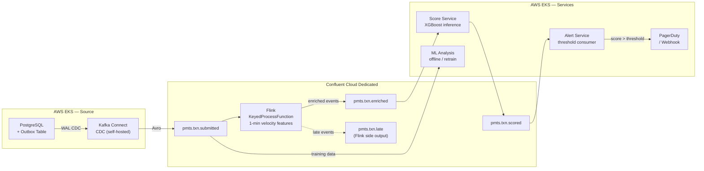

# Real-Time Fraud Detection Platform — Fintech Case Study

## Business Context

A mid-size fintech processes card transactions at 8,000 TPS steady-state, spiking to 25,000 TPS during flash sales and end-of-month payroll cycles. Their existing fraud detection runs as a batch ML scoring job every 15 minutes. By the time a fraudulent transaction is flagged, the funds have already moved. The business target is sub-500ms end-to-end detection latency — from transaction event to fraud alert fired.

The platform is AWS-native (EKS), with Confluent Cloud Dedicated already provisioned. The transaction source is a PostgreSQL database on EKS in a private VPC. There is existing Kafka experience in-house, but this is the first Kafka deployment for the fraud detection use case.

**Constraints:**
- PCI-DSS compliance — strict. Card data, tokenized references, and transaction amounts require encryption at rest and in transit.
- Alerting-only (not transaction-blocking). The fraud score informs risk operations, but does not gate the payment authorisation path.
- Self-hosted Kafka Connect on EKS — the PostgreSQL source is behind a private network unreachable from Confluent Cloud's managed connector fleet.

---

## Latency Budget

The 500ms target is allocated across five hops:

| Hop | Budget | Risk note |
|---|---|---|
| CDC capture (WAL → Kafka) | 50ms | WAL replication lag spikes under load — budget for 95th percentile |
| Broker ingest | 5ms | Confluent Cloud Dedicated, same-region |
| Flink enrichment | 100ms | RocksDB state lookup + velocity feature computation |
| ML scoring (XGBoost inference) | 50ms | Random forest / XGBoost — not neural network (5ms is unrealistic for deep models) |
| Alert firing (PagerDuty / webhook) | 20ms | |
| **Buffer** | **275ms** | Absorbs rebalance events, GC pauses, broker leader elections |

The 50ms scoring budget constrains model complexity. Neural networks and deep ensembles require GPU inference to hit this target. XGBoost on CPU with pre-joined features is well within budget.

---

## Architecture



---

## Key Design Decisions

### Source Ingest — Transactional Outbox + CDC

The payment service writes to the outbox table atomically within the same PostgreSQL transaction as the payment record. Debezium reads the WAL via Kafka Connect (self-hosted on EKS) and publishes to `pmts.txn.submitted`.

**Why outbox, not direct producer:** a direct produce call from the payment service creates a dual-write problem — the database write and the Kafka write can succeed or fail independently. The outbox pattern makes the Kafka event a side-effect of a committed database transaction, eliminating the dual-write gap. See `10-Operational-Patterns/transactional-outbox.md`.

**Why self-hosted Connect:** the PostgreSQL source is in a private VPC. Confluent Cloud managed connectors cannot reach private endpoints without PrivateLink, which adds cost and complexity. Self-hosted Connect on EKS runs inside the same VPC as the database. Credentials are injected via AWS SSM Parameter Store + Secrets Store CSI Driver — not hardcoded in the connector config. See `10-Operational-Patterns/connector-onboarding.md`.

### Flink Processing — KeyedProcessFunction, Not Window Aggregate

The enrichment stage computes velocity features per card (`payment_method_token`) and per merchant (`merchant_id`) over a 1-minute lookback window. The output is **one enriched event per input transaction** — not one aggregate per window interval.

Implementation: Flink `KeyedProcessFunction` with RocksDB `ListState` per key, TTL = 1 minute. For each incoming transaction:

1. Look up current state (events in the last 60 seconds for this card and merchant)
2. Compute velocity features: transaction count, amount sum, merchant count
3. Enrich the raw event with velocity features
4. Update RocksDB state with the new event
5. Register a cleanup timer (TTL = 60s)
6. Emit one enriched event to `pmts.txn.enriched`

A traditional sliding window aggregate (e.g., 1-min window, 10-second slide) would emit one aggregate row per slide interval, not per transaction. The Score Service needs one scoreable event per payment — the `KeyedProcessFunction` pattern is the correct choice.

**Late event handling:** Flink watermarks use event time (`submitted_at` field) with 200ms allowed lateness to absorb CDC lag spikes. Events arriving beyond the allowed lateness window are routed to a Flink side output, published to `pmts.txn.late` for inspection and re-drive. They are not silently dropped.

### Partition Key — `customer_id`, Protected by Ingress Quota

The partition key for `pmts.txn.submitted` is `customer_id`.

**Why not `payment_method_token`:** `payment_method_token` is tagged PCI and encrypted at the value payload layer via CSFLE. Using it as the Kafka message key would expose the plaintext token in the key, bypassing the encryption. `customer_id` avoids this.

**Hot partition protection via ingress quota, not compound key:** a single compromised customer account under a bot attack could produce thousands of TPS to one partition. A compound key (`customer_id` + random suffix) distributes the load but requires runtime rate detection at the producer — significant operational complexity. The simpler and correct solution: Confluent Cloud ingress quotas per producer principal, enforced at the broker. This throttles the producer immediately and surfaces the problem at the source rather than silently redistributing it.

### Delivery Guarantee — At-Least-Once

Exactly-once semantics through Flink's transactional producer adds ~20–50ms per checkpoint interval and significant operational complexity. For an alerting-only use case:

- **Duplicate alert:** the same fraudulent transaction triggers two alerts. Operationally manageable — PagerDuty deduplication by idempotency key handles this.
- **Missed alert:** a fraudulent transaction goes undetected. Unrecoverable.

At-least-once is the correct tradeoff. EOS is reserved for transaction-blocking or financial ledger use cases where duplicate writes produce incorrect state.

### ML Analysis — Offline Consumer on Raw Topic

Two consumers are independent: the Score Service (real-time XGBoost inference) and the ML Analysis service (offline model retraining). They read from different topics:

| Service | Topic | Role |
|---|---|---|
| Score Service | `pmts.txn.enriched` | Real-time inference, sub-500ms path |
| Alert Service | `pmts.txn.scored` | Threshold consumer, fires PagerDuty alert |
| ML Analysis | `pmts.txn.submitted` | Offline feature engineering, model retraining |

ML Analysis must read from the raw submitted topic, not the scored topic. Training on scored events creates circular feedback — the model learns to agree with itself over time and degrades at detecting novel fraud patterns.

---

## Schema Design — `pmts.txn.submitted`

```json
{
  "type": "record",
  "name": "PaymentSubmitted",
  "namespace": "com.client.payments",
  "fields": [
    { "name": "payment_id",           "type": "string" },
    { "name": "customer_id",          "type": "string" },
    { "name": "payment_method_token", "type": "string" },
    { "name": "merchant_id",          "type": "string" },
    {
      "name": "amount",
      "type": { "type": "bytes", "logicalType": "decimal", "precision": 10, "scale": 2 }
    },
    { "name": "currency", "type": "string" },
    {
      "name": "payment_method",
      "type": {
        "type": "enum",
        "name": "PaymentMethod",
        "symbols": ["CREDIT_CARD", "DEBIT_CARD", "BANK_TRANSFER", "PAYPAL", "APPLE_PAY"],
        "default": "CREDIT_CARD"
      }
    },
    { "name": "status",       "type": "string", "default": "SUBMITTED" },
    { "name": "submitted_at", "type": { "type": "long", "logicalType": "timestamp-millis" } },
    { "name": "metadata",     "type": ["null", { "type": "map", "values": "string" }], "default": null }
  ]
}
```

**Compatibility mode:** `FULL_TRANSITIVE` — the topic has multiple independent consumers (Flink, ML Analysis, any future consumer). Every consumer must be able to read every schema version.

**PCI tagging** (via Schema Registry Tags API post-registration):
```json
{ "fieldName": "payment_method_token", "tags": ["PCI"] }
```

CSFLE encryption is triggered by the PCI tag. Consumers without KMS access receive ciphertext for `payment_method_token`. The Score Service requires KMS access to decrypt the token for card-level velocity grouping in Flink's `keyBy()`.

**Enum evolution:** the `default` field inside the enum type (not the field default) is the Avro 1.9+ mechanism for handling unknown symbols. If `GOOGLE_PAY` is added in a future schema version, old readers encountering the new symbol fall back to `CREDIT_CARD`. Without this default, old readers throw on deserialisation.

**`amount` as `bytes/decimal`:** financial amounts must never be stored as `float` or `double`. IEEE 754 floating point cannot represent most decimal fractions exactly — rounding errors in financial calculations are a compliance issue. `bytes` with `decimal` logical type preserves exact precision.

**Key velocity fields:** `payment_method_token` enables card-level velocity (transactions per card per minute). `merchant_id` enables merchant-level velocity (transactions per merchant per minute). Both are required for meaningful fraud signal computation in Flink.

---

## DLQ Topology

Error handling differs across the four processing hops. The pattern is not uniform.

| Hop | DLQ mechanism | Who manages routing | Re-drive approach |
|---|---|---|---|
| Kafka Connect CDC | `errors.deadletterqueue.topic.name` config | Connect framework (automatic) | `kafka-connect-dlq-redrive` tool or manual consumer |
| Flink late events | Side output → `pmts.txn.late` | Flink operator (side output sink) | Replay with adjusted event time after root cause fix |
| Score Service | Consumer catch → produce to DLQ → commit offset | Application code | Inspect, fix model/config, re-produce from DLQ |
| Alert Service | Exponential backoff (3 retries) → produce to DLQ | Application code | Inspect, retry after alert destination recovery |

The Alert Service DLQ has a distinct retry policy: transient PagerDuty or webhook outages should not immediately route to DLQ. Three retries with exponential backoff before committing the event to DLQ. The other application-layer DLQ (Score Service) routes immediately — an XGBoost inference failure is not transient.

---

## Open Decisions

**Alert threshold:** the Score Service fires an alert when `fraud_score > threshold`. The threshold value is not yet defined. Static thresholds require manual tuning as fraud patterns evolve. A dynamic threshold calibrated by the ML Analysis pipeline (e.g., 95th percentile of recent scores) requires a feedback loop between the offline model and the real-time scoring path.

**Fraud case management:** the design fires an alert to PagerDuty/webhook. What the risk operations team does with the alert — case creation, customer contact, card blocking — is out of scope for this platform design but must be wired before go-live.

**Multi-region DR:** no DR strategy has been decided. The current design is single-region (AWS us-east-1 or equivalent). For a payment platform, RPO and RTO targets must be agreed with the business before go-live. Cluster Linking to a secondary region is the recommended starting point. See `12-Multi-Region-DR/cluster-linking.md`.

**Flink RocksDB pre-seeding:** at 25,000 TPS peak, the Flink state store will grow large quickly. A cold start (container failure, rolling restart) will incur RocksDB changelog rebuild time — potentially 30–60 minutes of lag accumulation. S3 pre-seeding of the RocksDB state reduces cold start time significantly. See `10-Operational-Patterns/rocksdb-s3-preseeding.md`.

---

## Cross-References

- Transactional outbox pattern — [10-Operational-Patterns/transactional-outbox.md](../10-Operational-Patterns/transactional-outbox.md)
- Kafka Connect self-hosted on EKS, credential injection — [10-Operational-Patterns/connector-onboarding.md](../10-Operational-Patterns/connector-onboarding.md)
- Debezium CDC configuration — [10-Operational-Patterns/cdc-debezium.md](../10-Operational-Patterns/cdc-debezium.md)
- Partition key design and hot key mitigation — [02-Broker-Infrastructure/partitioning-strategies.md](../02-Broker-Infrastructure/partitioning-strategies.md)
- Producer ingress quotas — [13-Performance-Tuning/quota-management.md](../13-Performance-Tuning/quota-management.md)
- Flink vs Kafka Streams decision — [06-Stream-Processing/kafka-streams-vs-flink.md](../06-Stream-Processing/kafka-streams-vs-flink.md)
- RocksDB state and pre-seeding — [10-Operational-Patterns/rocksdb-s3-preseeding.md](../10-Operational-Patterns/rocksdb-s3-preseeding.md)
- Exactly-once semantics (why at-least-once is chosen here) — [07-Advanced-Reliability/exactly-once-semantics.md](../07-Advanced-Reliability/exactly-once-semantics.md)
- CSFLE for PCI field encryption — [08-Stream-Governance/csfle.md](../08-Stream-Governance/csfle.md)
- Schema evolution and FULL_TRANSITIVE compatibility — [08-Stream-Governance/schema-evolution.md](../08-Stream-Governance/schema-evolution.md)
- Consumer DLQ patterns — [05-Enterprise-Connect/error-handling-dlq.md](../05-Enterprise-Connect/error-handling-dlq.md)
- Consumer lag monitoring and alerting — [11-Monitoring-Observability/consumer-lag.md](../11-Monitoring-Observability/consumer-lag.md)
- Multi-region DR starting point — [12-Multi-Region-DR/cluster-linking.md](../12-Multi-Region-DR/cluster-linking.md)
