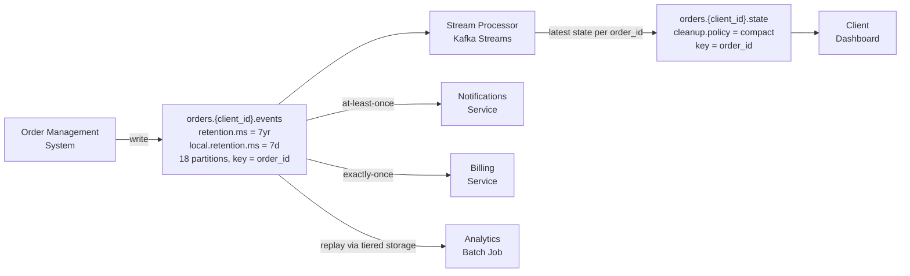

# Case Study — Logistics Order Tracking: Topic Design

## Problem Statement

B2B logistics SaaS platform. Retailers (clients) push orders into the system; orders flow through a lifecycle: `CREATED → PICKED → PACKED → SHIPPED → IN_TRANSIT → DELIVERED`, with `CANCELLED` and `RETURNED` branches.

| Dimension | Detail |
|---|---|
| Peak volume | 50,000 order events/minute across all clients |
| Clients | 15 today, growing to 100 within 18 months |
| Average order lifecycle | 3–5 days |
| Peak active orders | ~2 million |
| Downstream consumers | Client dashboard (real-time), billing (exactly-once on DELIVERED), notifications (at-least-once), analytics (6-hour batch) |
| Regulatory | GDPR for EU clients; right-to-erasure at individual customer level |

---

## Discovery Questions — What to Ask First

Before touching topology, establish the structural constraints. These two questions gate every other decision:

**1. Do consumers need ordering for the same entity?**
Yes — the dashboard and billing service must see `SHIPPED` before `IN_TRANSIT` for the same order. This immediately rules out one-topic-per-event-type: you lose Kafka's native within-partition ordering guarantee and must reintroduce it via timestamp-based joins across topics.

**2. Do clients need data isolation?**
Yes — B2B clients cannot read each other's order data. Kafka ACLs are topic-level, not record-level. This rules out a single shared topic unless you fan-out to per-client derived topics (which still leaves commingled PII in the shared source).

These two answers drive the foundational topology decision before any other question is relevant. Retention, partitioning, and schema decisions come after.

**Additional required questions:**
- Payload size estimate (needed for partition math)
- Retention requirements per consumer (drives tiered storage config)
- Current state vs full history (drives compaction decision)
- Schema change frequency (drives compatibility mode)
- PII fields and erasure granularity (drives crypto-shredding key design)

---

## Final Topic Topology

```
orders.{client_id}.events     — source of truth, time-based retention
orders.{client_id}.state      — derived, compacted, current status per order
```



---

## Key Design Decisions

### 1. Single topic with event_type field, not one topic per event type

**Ruled out:** `orders.created`, `orders.shipped`, `orders.delivered` — 8 separate topics.

**Why:** any consumer reconstructing order state must join across all 8 topics. Kafka guarantees offset ordering within a partition, not across topics. You must introduce timestamp-based ordering logic to determine which event is "latest" for a given order — a fragile dependency on producer wall-clock accuracy. A single topic keyed by `order_id` gives ordering for free via partition offset.

### 2. Per-client source topics, not a shared topic with fan-out

**Ruled out:** single `orders.events` → fan-out stream processor → per-client derived topics.

**Why the fan-out approach fails:** the shared source still contains all clients' commingled PII. The fan-out processor holds read access to every client's data — a single routing bug sends Client A's orders to Client B. Every new client onboard requires fan-out config changes.

**Per-client source topology:** producers route at write time to `orders.{client_id}.events`. ACLs are per-topic. No fan-out processor required. 100 topics at 100 clients is operationally fine on Confluent Cloud.

### 3. Tiered storage for conflicting retention requirements

Consumers have incompatible retention needs on the same topic:

| Consumer | Retention need |
|---|---|
| Billing | 7 years (financial compliance) |
| Analytics | 6 months |
| Dashboard | 7 days + current state |

One topic has one retention policy. Tiered storage resolves this without duplicating data:

```
local.retention.ms  = 7 days    # move to object storage after 7 days
retention.ms        = 7 years   # keep accessible for 7 years total
```

Consumers use the standard Kafka consumer API regardless of whether data is on local disk or in object storage. Setting `retention.ms` to 7 days would delete data from tiered storage too — a common misconfiguration.

### 4. Compacted state topic for dashboard, written by stream processor only

The dashboard needs current order status without replaying years of events on restart. A derived compacted topic `orders.{client_id}.state` retains only the latest record per `order_id`.

**Who writes to it:** a stream processor (Kafka Streams) reading from the events topic. The producer does not dual-write directly — dual-write introduces consistency risks if the producer write succeeds but the state write fails.

**Tombstone on completion:** when an order reaches a terminal state and is no longer needed, produce a null-value record to trigger compaction cleanup.

### 5. Partition count: provision for max consumer parallelism, not throughput

| Factor | Value |
|---|---|
| Payload size | ~3 KB |
| Peak per large-client | ~500 events/second = 1.5 MB/s |
| Throughput-based partitions | 1.5 MB/s ÷ 10 MB/s = 1 (not the binding constraint) |
| Binding constraint | Max consumer instances per group |
| Target | 6 consumers, 3× growth headroom → **18 partitions** |

**Why provision upfront:** increasing partitions after the topic has data breaks `murmur2(key) mod N` mapping. Historical messages stay in old partitions; new messages for the same `order_id` land in different partitions. Consumers must read multiple partitions to reconstruct full order history. This is a semantic break, not just an operational cost.

### 6. Shared Schema Registry subject with metadata map

All clients share one Avro schema subject. Enterprise clients needing custom fields use a `metadata: map<string, string>` field — no per-client subjects to maintain.

**Compatibility mode:** `FULL_TRANSITIVE` — multiple downstream consumers at different schema versions must coexist. See `08-Stream-Governance/schema-evolution.md`.

### 7. GDPR crypto-shredding: erasure key per customer_id, not client_id

PII fields (customer name, delivery address, phone) are encrypted with a key scoped to the individual customer (`customer_id`). When a data subject triggers erasure, delete their specific key — only their records become unreadable.

**Why not per client_id:** rotating a client-level key would erase all of that client's customers' data — destroying an entire enterprise client's order history to honor one individual erasure request.

See `08-Stream-Governance/pii-tracking.md` for the crypto-shredding pattern.

---

## Topic Design Anti-Patterns Encountered

| Anti-pattern | Why it fails |
|---|---|
| One topic per event type for stateful entities | Breaks offset ordering; requires N-way join across topics |
| Shared source topic → fan-out for isolation | Commingled PII in source; routing bug blast radius is all clients |
| Erasure key per tenant (client_id) | Can only erase an entire client's data, not one customer |
| `retention.ms = 7 days` with tiered storage | Deletes tiered data too — billing loses 7-year audit trail |
| Dual-write from producer to state topic | Inconsistency if events write succeeds but state write fails |
| "Increasing partitions is expensive" | The cost is semantic (ordering breaks), not computational |

---

## Cross-References

- `02-Broker-Infrastructure/partitioning-strategies.md` — partition sizing formula, compaction vs retention, key-based ordering guarantee
- `02-Broker-Infrastructure/tiered-storage.md` — `local.retention.ms` vs `retention.ms`, Confluent Cloud tiered storage config
- `08-Stream-Governance/schema-evolution.md` — FULL_TRANSITIVE compatibility, multi-consumer schema coexistence
- `08-Stream-Governance/pii-tracking.md` — crypto-shredding, erasure key granularity
- `09-Security-Architecture/rbac.md` — per-topic ACL patterns for B2B multi-tenancy
- `10-Operational-Patterns/blue-green-topic-migration.md` — safe procedure for partition count changes on live topics
