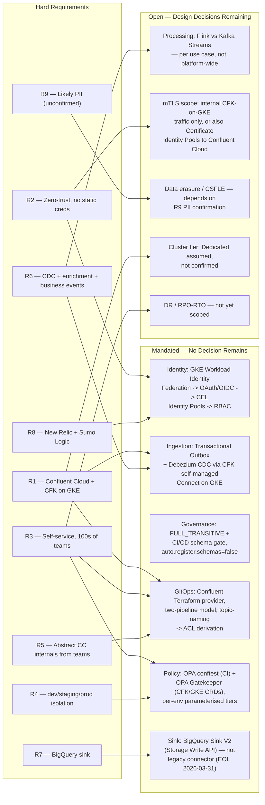
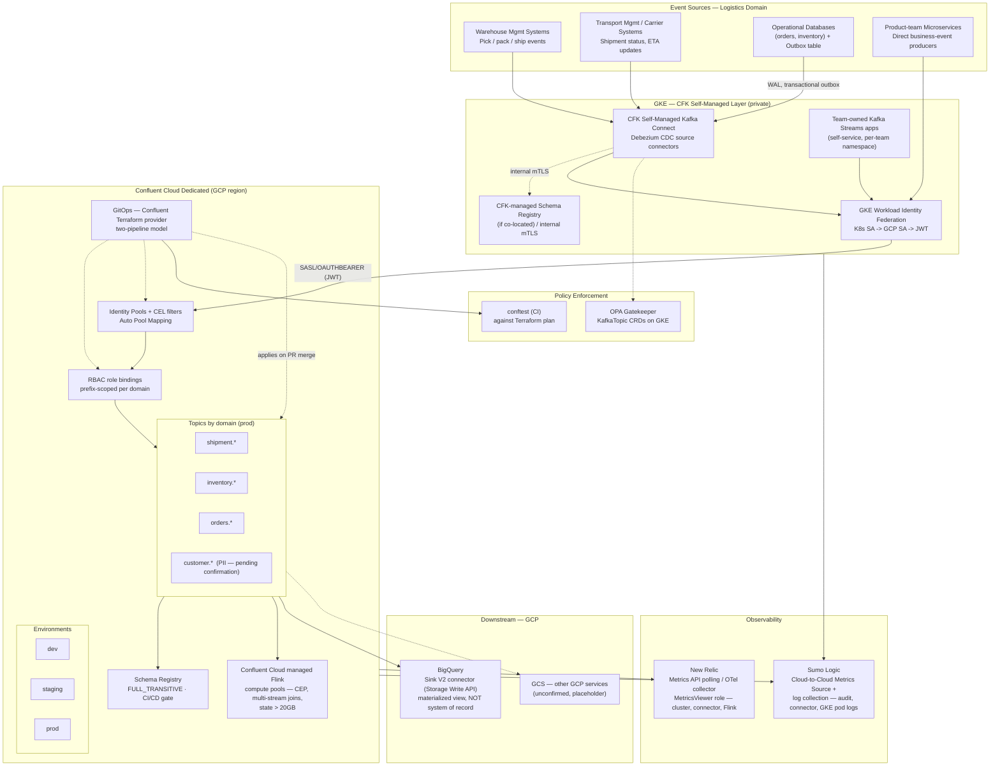

# Logistics Platform Engineering — Self-Service Confluent Cloud + CFK Platform on GCP

A platform engineering team builds and operates a shared, self-service event-streaming platform on Confluent Cloud + Confluent for Kubernetes (CFK) for a logistics organisation. Internal product teams — hundreds of them — use the platform to design and implement event-driven use cases (CDC pipelines, real-time enrichment, business events) without needing to understand broker architecture, Schema Registry internals, consumer group mechanics, or Confluent Cloud's control plane. This case study walks the platform-as-a-product design: what the platform team builds once, what it exposes as a self-service golden path, and what remains a platform-team-only decision.

Unlike the other case studies in this module, this is not a single business-vertical pipeline — it is the platform *underneath* many pipelines. The requirement → selection map below reflects that: several dimensions resolve to "framework, not a fixed choice" because the platform must support use cases that don't exist yet.

## Confirmed Context

- **Owner:** A dedicated platform engineering team, not an individual product team
- **Consumers:** Hundreds of internal teams across the logistics organisation
- **Primary use-case classes:** CDC pipelines (source systems → Kafka), real-time enrichment (stateful stream processing), general business events (domain event publishing)
- **Security mandate:** Zero-trust — no shared or long-lived static credentials, every workload individually authenticated
- **Environments:** Three — dev, staging, prod (one Confluent Cloud environment/cluster per tier)
- **Kubernetes:** CFK (Confluent for Kubernetes) running on GKE
- **Cloud:** GCP preferred; AWS/Azure acceptable as portable alternatives
- **GCP integration:** BigQuery confirmed as a downstream sink; other GCP services not yet specified
- **Confirmed scale (rough estimates you provided):** ~20 events per parcel; 33.8M business events/day average, 60M/day peak; ~391 events/sec average, ~694 events/sec peak measured over a 24-hour basis; ~1,190 events/sec effective sustained rate when the peak-day volume is spread across a 14-hour operational window instead of 24 hours; 1,500–3,000 Kafka topics estimated in production. **Explicitly excluded from this estimate:** vehicle telemetry, handheld scanner events, customer tracking events, and notification events — these are separate, not-yet-sized domains that will add to both event volume and topic count as they onboard.

## Scale and Sizing Implications

These are read directly off the confirmed numbers above, using the sizing formulas already documented elsewhere in this guide — not new heuristics invented for this case study.

**Which rate to design against:** three different numbers are all technically correct depending on the question:

| Rate | Basis | Use for |
|---|---|---|
| ~391 events/sec | 33.8M/day ÷ 86,400s (an average day, spread over 24h) | Long-run capacity planning, cost modeling |
| ~694 events/sec | 60M/day ÷ 86,400s (a peak day, spread over 24h) | Understates real load — operations don't actually run 24/7 |
| **~1,190 events/sec** | 60M/day ÷ 50,400s (a peak day, spread over the real 14-hour operational window) | **The number to size the platform against** — this is the realistic sustained rate during active hours |

None of these three capture intra-window bursting (e.g., a shift-start or dispatch-wave spike within the 14-hour window) — that would require finer-grained data than "events/day," and isn't assumed here.

**Confluent Cloud CKU sizing — one input still missing:** per [oss-to-confluent-cloud-migration.md](../10-Operational-Patterns/oss-to-confluent-cloud-migration.md), the rule of thumb is 1 eCKU ≈ 50 MB/s produce + 150 MB/s consume, sized off *peak MB/s*, not events/sec, with 1.5× headroom on top of observed peak. Converting ~1,190 events/sec to MB/s requires an average event payload size in bytes — not provided, and not assumed here. That's the next number needed before a CKU count can be stated with any confidence; everything else in this section holds regardless of payload size.

**Partition count — needs a per-domain breakdown, not a platform-wide average:** per [topic-design-framework.md](../topic-design-framework.md), `partitions = max(target_throughput ÷ per-partition throughput, expected_max_consumers) × 2–3× growth factor`, applied **per topic**, not as a platform-wide average. Dividing ~1,190 events/sec evenly across 1,500–3,000 topics (~0.4–0.8 events/sec/topic) would be misleading — the ~20-events-per-parcel figure suggests shipment/tracking-status topics carry disproportionate volume compared to, say, low-frequency reference-data topics. A per-domain volume breakdown (what share of the 1,190 events/sec is shipment status vs inventory vs orders vs other domains) is needed before partition counts can be set per topic-tier; sizing every topic the same regardless of its actual traffic share would either under-provision the hot domains or waste partitions everywhere else.

**Topic count implications:** 1,500–3,000 topics is high enough that Schema Registry subject count (one subject per topic by default), RBAC prefix-binding count, and OPA Gatekeeper `Constraint` count all scale with it directly — none of that is a problem given the automation pyramid already designed below, but it does mean the CI pipeline's `terraform plan` step should be checked for plan-generation time at that scale before go-live, since very large plans can slow the PR feedback loop.

**Cluster tier — reframing the earlier open item:** the confirmed sustained rate (~1,190 events/sec, likely low-to-mid single-digit MB/s once payload size is known) is not by itself large enough to force Dedicated. The actual driver for Dedicated is unchanged: CFK on GKE needs private connectivity (Private Service Connect) to reach Confluent Cloud, and Basic/Standard clusters don't support private networking or Certificate Identity Pools. So Dedicated remains the right default, but for a network-topology reason, not a throughput reason — worth stating precisely so a future capacity conversation doesn't try to downgrade the tier based on the (modest) event rate alone.

## Assumptions and Open Items — Confirm Before Build

Per this project's standing instruction not to invent facts, the items below are **not** confirmed by you and are treated as illustrative placeholders only:

| Open item | Why it matters | Status |
|---|---|---|
| Average event payload size (bytes) | Converts events/sec to MB/s — the actual Confluent Cloud CKU sizing input | Not provided — CKU count cannot be estimated without it |
| Per-domain volume breakdown (shipment vs inventory vs orders vs other, as a share of the ~1,190 events/sec) | Drives per-topic partition counts; platform-wide average would be misleading | Not provided |
| Volume/topic count for vehicle telemetry, handheld scanners, customer tracking, notifications | These are confirmed as excluded from the 1,500–3,000 topic / 1,190 events/sec figures, not yet sized themselves | Explicitly out of scope for now — expect additional load when these domains onboard |
| Full list of GCP services beyond BigQuery | Determines connector inventory (GCS, Pub/Sub bridge, Dataflow, etc.) | Only BigQuery Sink is designed in detail |
| Compliance scope (PII in shipment/customer data, data residency) | Determines whether CSFLE/crypto-shredding is mandatory, not optional | Assumed logistics data contains at least customer/shipment PII (addresses, contact info) — **confirm** |
| Confluent Cloud cluster tier (Basic/Standard/Dedicated) | Dedicated needed for private networking (GKE→Confluent Cloud) and Certificate Identity Pools | Assumed **Dedicated** — driven by private connectivity, not throughput (see Scale and Sizing Implications above) — **confirm before committing budget** |
| RPO/RTO / DR requirement | Determines Cluster Linking vs no DR | Not addressed in this document — flagged as an open decision below |

---

## Platform Capability Map

Mapping the capability list from the platform charter to the technology chosen and where it's grounded in this guide:

| Capability | Technology | Platform team owns | Guide reference |
|---|---|---|---|
| Design & implement event-driven use cases (Connect, Confluent Cloud, Flink) | Kafka Connect (CFK self-managed + Confluent-managed), Confluent Cloud, Confluent Cloud managed Flink | Golden-path templates; compute pool and connector provisioning | [05-Enterprise-Connect](../05-Enterprise-Connect/README.md), [06-Stream-Processing](../06-Stream-Processing/README.md) |
| Abstract broker architecture, Schema Registry, consumer groups, CC internals | GitOps (Terraform), topic naming convention, PR-based self-service pipeline | The abstraction layer itself — teams submit YAML/PRs, never touch the Console | [platform-automation.md](../10-Operational-Patterns/platform-automation.md), [gitops-terraform.md](../10-Operational-Patterns/gitops-terraform.md) |
| Monitoring / observability | New Relic (metrics), Sumo Logic (logs, audit) | Dashboards, alert thresholds, monitoring service account scoping | [11-Monitoring-Observability](../11-Monitoring-Observability/README.md) |
| Security: OAuth2, mTLS, RBAC | GKE Workload Identity Federation → OAuth/OIDC → CEL Identity Pools → RBAC; mTLS for in-cluster CFK component traffic | Identity Pool CEL filters, RBAC role taxonomy, cert lifecycle for internal mTLS | [09-Security-Architecture](../09-Security-Architecture/README.md) |
| Stream processing: Flink, Kafka Streams | Confluent Cloud managed Flink compute pools (platform-provisioned) + team-owned Kafka Streams apps (self-service) | Compute pool sizing; framework-selection guidance published to teams | [kafka-streams-vs-flink.md](../06-Stream-Processing/kafka-streams-vs-flink.md), [stream-processing-framework.md](../stream-processing-framework.md) |
| Kubernetes, Terraform, CI/CD, Docker | GKE + CFK CRDs (ArgoCD/Crossplane), Confluent Terraform provider, conftest/OPA Gatekeeper, Docker images for Connect workers and custom SMTs | The two-pipeline GitOps model end to end | [10-Operational-Patterns](../10-Operational-Patterns/README.md) |
| Cloud (GCP) | GKE, GCP Workload Identity Federation, Private Service Connect, BigQuery Sink V2 | GCP IAM bindings, PSC endpoints, connector inventory | [cloud-idp-integration.md](../09-Security-Architecture/cloud-idp-integration.md), [private-networking.md](../09-Security-Architecture/private-networking.md) |
| Messaging systems & scripting (Python/Bash) | Kafka client libraries, Bash/Python for CI/CD steps and operational tooling (DLQ redrive, naming-convention validation) | Publishes client config templates and operational scripts as part of the golden path | Various — DLQ redrive pattern in [fintech-fraud-detection.md](fintech-fraud-detection.md) |

This mapping is also the platform team's own job description — each row is a thing the platform team owns so 100+ product teams don't have to.

---

## Hard Requirements

| ID | Requirement | Class |
|---|---|---|
| R1 | Confluent Cloud + CFK on GKE — hybrid managed/self-managed, not fully self-managed OSS | Infrastructure |
| R2 | Zero-trust — no static, shared, or long-lived credentials anywhere in the platform | Security |
| R3 | Self-service at scale — hundreds of independently-releasing teams onboard without platform-team tickets for standard operations | Scale |
| R4 | Three isolated environments (dev/staging/prod) with different policy tiers | Operational |
| R5 | Platform must abstract broker/SR/consumer-group/CC internals from consuming teams | Platform design |
| R6 | Support CDC pipelines, stateful enrichment, and general business-event publishing as first-class use-case classes | Use-case breadth |
| R7 | BigQuery as a confirmed downstream analytics sink | Integration |
| R8 | Dual observability stack — New Relic and Sumo Logic, split by concern | Observability |
| R9 | Likely PII in logistics/customer/shipment data — **pending confirmation** | Compliance (assumed) |

## Requirement → Selection Map

---

## Platform Architecture

---

## Key Design Decisions

### 1. Identity is the load-bearing zero-trust control, not network location

Zero-trust here means no service — inside GKE or outside it — authenticates with a static, shared, or long-lived credential. GCP Workload Identity Federation on GKE is the mechanism: a Kubernetes ServiceAccount is bound to a GCP Service Account, which GKE's metadata server issues as a short-lived JWT with no key file ever stored. That JWT is presented to Confluent Cloud via `SASL/OAUTHBEARER`, matched against a CEL filter on an Identity Pool, and mapped to RBAC role bindings scoped by topic prefix.

This is Approach C (credential-free workload identity) from [cloud-idp-integration.md](../09-Security-Architecture/cloud-idp-integration.md), and it's the only approach that scales cleanly to hundreds of teams — the alternative (one Confluent service account + API key per team) creates a rotation and revocation burden that grows linearly with team count. With **Auto Pool Mapping**, onboarding a new team becomes a single RBAC role-binding PR — no new service account, no secret distribution.

**Where mTLS still applies:** CFK generates and manages internal mTLS certificates for communication *within* the GKE cluster — Connect workers to Schema Registry, inter-component calls. That internal mTLS identity is never forwarded to Confluent Cloud; the Connect worker switches to `SASL/OAUTHBEARER` for the outbound leg. If the cluster tier is confirmed as Dedicated and a Certificate Identity Pool is configured, mTLS could additionally be used for the CFK→Confluent Cloud leg — this is left open pending confirmation of cluster tier (see Open Items). See [mtls-oauth.md](../09-Security-Architecture/mtls-oauth.md) for the full mechanics of both paths.

### 2. Self-service is the platform, not a feature of the platform

With hundreds of consuming teams, ticket-based provisioning does not scale. The design follows the automation pyramid in [platform-automation.md](../10-Operational-Patterns/platform-automation.md): topic creation, ACL derivation from the naming convention (`{domain}.{entity}.{event-type}.v{N}`), schema registration, and quota application are fully automated on PR merge. Only PII-tagged topics, new service principal onboarding, and cross-domain access require a human review gate — everything else is zero-touch.

This is also how the platform satisfies R5 (abstract broker/SR/consumer-group/CC internals): a product team's entire interaction with the platform is a YAML file and a schema file in a PR. They never see the Confluent Cloud Console, never manually create a consumer group, and never touch Schema Registry compatibility settings directly.

### 3. CDC ingestion uses the outbox + Debezium pattern, self-managed via CFK on GKE

Logistics source systems (warehouse management, transport/carrier systems, operational databases) are assumed to sit behind private network boundaries not reachable by Confluent Cloud's managed connector fleet — the same situation as the retail case study's on-prem ERP/WMS integration (see [retail-platform-design.md](retail-platform-design.md)). CFK self-managed Kafka Connect on GKE runs inside the same network perimeter as the source systems.

For any source with a transactional database of record, the transactional outbox pattern ([transactional-outbox.md](../10-Operational-Patterns/transactional-outbox.md)) avoids the dual-write problem: the application writes its business state and a serialized event to an outbox table in one local transaction, and Debezium relays committed rows via WAL/binlog read — not polling. This gives sub-second latency with near-zero load on the source database. Delivery is at-least-once; consumers downstream must be idempotent. See [cdc-debezium.md](../10-Operational-Patterns/cdc-debezium.md) for connector configuration and schema-change handling.

### 4. Flink vs Kafka Streams is a per-use-case decision, published as guidance — not a platform-wide mandate

Because this platform serves use cases that don't exist yet, the platform team's job is not to pick one framework but to publish the selection criteria and provision the shared infrastructure both paths need:

- **Kafka Streams** — for team-owned, Kafka-to-Kafka enrichment embedded in a team's own microservice, where state fits in tens of GB and the team wants ownership within their own CI/CD and monitoring stack. No platform-team involvement beyond standard topic/ACL provisioning.
- **Confluent Cloud managed Flink** — for CEP patterns (e.g., shipment-exception sequence detection, similar to [real-time-shipment-tracking.md](real-time-shipment-tracking.md)), multi-stream joins across heterogeneous logistics event sources, or state exceeding ~20GB. The platform team provisions Flink compute pools via Terraform (`confluent_flink_compute_pool`) per domain, so a product team requests capacity rather than standing up their own cluster.

Full criteria in [kafka-streams-vs-flink.md](../06-Stream-Processing/kafka-streams-vs-flink.md) and [stream-processing-framework.md](../stream-processing-framework.md).

### 5. GitOps splits into two pipelines, and Kubernetes reconciliation is a separate concern from Confluent Cloud reconciliation

Per [gitops-terraform.md](../10-Operational-Patterns/gitops-terraform.md), the infrastructure pipeline (environments, clusters, Identity Pools, Flink compute pools) is platform-team-only and privileged; the cluster pipeline (topics, ACLs, RBAC bindings, schemas, connectors) can be delegated to team-scoped PRs within guardrails.

Critically, **ArgoCD on GKE does not understand Confluent Cloud resources** — it reconciles CFK `KafkaConnector` CRDs and Kubernetes manifests continuously, but Confluent Cloud topics/ACLs/schemas are Terraform resources applied on PR merge, not continuously reconciled. If continuous drift correction for Confluent Cloud resources itself is required (e.g., because Console access can't be fully locked down across hundreds of teams), Crossplane is the documented option — worth the added operational cost only if manual-drift correction is a real risk here.

### 6. Policy enforcement is layered to match where CI can be bypassed

Given CFK on GKE plus Confluent Cloud, both applicable enforcement points from [opa-policy-enforcement.md](../10-Operational-Patterns/opa-policy-enforcement.md) apply:

- `conftest` Rego policies against the Terraform plan in CI — catches violations before merge, works for Confluent Cloud resources where there's no broker-side hook available.
- OPA Gatekeeper admission webhook on CFK `KafkaTopic` CRDs on GKE — the backstop that fires even if someone applies directly with `kubectl`, bypassing CI.

Per-environment tiers (partition limits, replication factor) are expressed as Gatekeeper `Constraint` parameters and `conftest` policy inputs keyed off the environment segment in the topic name (`orders.dev.events` vs `orders.prod.events`) — one Rego policy, three environment-specific parameter sets for dev/staging/prod.

### 7. Downstream to BigQuery is a materialized view, not the source of truth

Consistent with this guide's core architectural principle — the broker is the system of record, databases (and warehouses) are materialized views rebuilt from topic replay — BigQuery is treated purely as a sink for analytics consumption, not a system any pipeline reads back from for business logic. The **BigQuery Sink V2 connector** (Storage Write API, gRPC-based, supports Avro/JSON Schema/Protobuf) is the correct choice for new integrations; the legacy BigQuery Sink connector reaches end-of-life 2026-03-31, so any design work happening now should target V2 directly rather than migrating later.

**Other GCP services** (Pub/Sub bridging, Dataflow, GCS) are not yet specified by you — flagged as an open item rather than assumed.

### 8. Observability splits by concern between New Relic and Sumo Logic

Following the same "Bring Your Own Monitoring" model documented for Datadog in [datadog-integration.md](../11-Monitoring-Observability/datadog-integration.md) — Confluent Cloud's Metrics API is the data feed, the third-party tool owns ingestion, dashboarding, and alerting:

- **New Relic** — cluster, connector, and Flink metrics via API Polling integration against the Confluent Cloud Metrics API, or the New Relic OpenTelemetry collector. Requires a service account scoped to `MetricsViewer` at organisation level (the same critical setup detail as Datadog: the API key must be a resource-management key, not a cluster-scoped key).
- **Sumo Logic** — logs and audit trail (connector logs, GKE pod logs from the CFK namespace, Confluent Cloud audit logs) plus a parallel metrics path via its Cloud-to-Cloud Integration Framework Confluent Cloud Metrics Source, which covers cluster, connector, Flink compute pool, and Schema Registry dashboards.

This split avoids paying for the same telemetry twice in two tools — New Relic is the primary metrics/dashboard surface, Sumo Logic is the log-of-record and audit surface, with some metrics overlap intentionally available in both for cross-verification during incidents.

---

## Decided vs Open

**Decided:**
- Identity model: GKE Workload Identity Federation → OAuth/OIDC → CEL Identity Pools → RBAC, with Auto Pool Mapping (forced by R2 + R3)
- CDC ingestion: transactional outbox + Debezium via CFK self-managed Connect on GKE (forced by R1 + R6 + private source systems)
- Schema governance: FULL_TRANSITIVE, `auto.register.schemas=false`, CI/CD compatibility gate (forced by R3 — shared platform, many independent consumers)
- GitOps: Confluent Terraform provider, two-pipeline model, naming-convention-driven ACL automation (forced by R3 + R5)
- Policy enforcement: conftest in CI + OPA Gatekeeper on CFK CRDs (forced by R1's hybrid CFK/Confluent Cloud topology)
- BigQuery sink: V2 connector, not legacy (forced by R7 + connector EOL timing)

**Open — needs a spike or a business answer, not a default:**
- Flink vs Kafka Streams per use case — resolved at onboarding time per the published criteria, not platform-wide
- Whether mTLS extends to the CFK→Confluent Cloud leg via Certificate Identity Pools, or stays OAuth/OIDC-only end to end — depends on confirming Dedicated tier
- CSFLE / crypto-shredding for PII — depends on confirming whether shipment/customer data actually contains PII (R9)
- DR strategy and RPO/RTO — not scoped in this document at all; needs a business SLA answer before cluster architecture is finalized
- Full GCP service inventory beyond BigQuery
- Average event payload size — needed to convert the confirmed ~1,190 events/sec into a CKU count
- Per-domain volume breakdown — needed to size partitions per topic rather than off a platform-wide average

---

## Cross-References

- [09-Security-Architecture/cloud-idp-integration.md](../09-Security-Architecture/cloud-idp-integration.md) — GCP Workload Identity Federation, multi-tenant decision matrix
- [09-Security-Architecture/cel-identity-pools.md](../09-Security-Architecture/cel-identity-pools.md) — CEL filter syntax, Auto Pool Mapping
- [09-Security-Architecture/rbac.md](../09-Security-Architecture/rbac.md) — role taxonomy, multi-tenant access model
- [09-Security-Architecture/mtls-oauth.md](../09-Security-Architecture/mtls-oauth.md) — mTLS vs OAuth decision factors, CFK-on-Kubernetes internal vs external auth paths
- [09-Security-Architecture/private-networking.md](../09-Security-Architecture/private-networking.md) — GCP Private Service Connect, data plane vs control plane
- [10-Operational-Patterns/gitops-terraform.md](../10-Operational-Patterns/gitops-terraform.md) — two-pipeline model, CFK CRDs, ArgoCD scope, Crossplane
- [10-Operational-Patterns/platform-automation.md](../10-Operational-Patterns/platform-automation.md) — automation pyramid
- [10-Operational-Patterns/opa-policy-enforcement.md](../10-Operational-Patterns/opa-policy-enforcement.md) — conftest + Gatekeeper enforcement points
- [10-Operational-Patterns/cdc-debezium.md](../10-Operational-Patterns/cdc-debezium.md) and [transactional-outbox.md](../10-Operational-Patterns/transactional-outbox.md) — CDC ingestion pattern
- [10-Operational-Patterns/connector-onboarding.md](../10-Operational-Patterns/connector-onboarding.md) — connector production gates
- [06-Stream-Processing/kafka-streams-vs-flink.md](../06-Stream-Processing/kafka-streams-vs-flink.md) and [stream-processing-framework.md](../stream-processing-framework.md) — framework selection
- [11-Monitoring-Observability/datadog-integration.md](../11-Monitoring-Observability/datadog-integration.md) and [confluent-cloud-metrics-api.md](../11-Monitoring-Observability/confluent-cloud-metrics-api.md) — third-party monitoring pattern (New Relic/Sumo Logic follow the same model)
- [retail-platform-design.md](retail-platform-design.md) — closest existing case study (self-managed Connect for on-prem sources, GitOps self-service model)
- [fintech-fraud-detection.md](fintech-fraud-detection.md) — DLQ topology and CDC+Flink pattern reference
- [real-time-shipment-tracking.md](real-time-shipment-tracking.md) — logistics-domain CEP and Flink enrichment pattern
