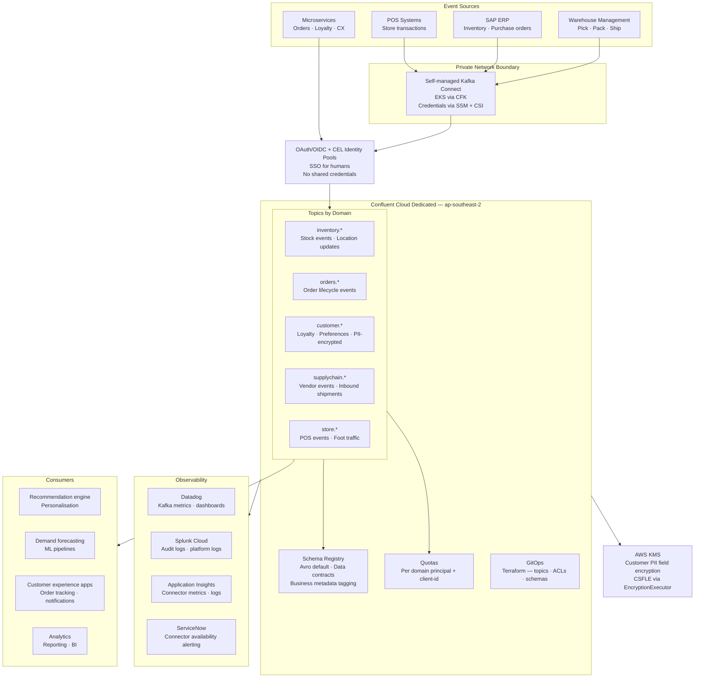

# Enterprise Retail Streaming Platform — Use Case and Design Validation

## Business Context

A national retail group operating 300+ stores across Australia with a significant online presence is modernising its data architecture from batch ETL to real-time event-driven. The organisation runs multiple product teams across domains: merchandising, supply chain, customer experience, loyalty, store operations, and demand forecasting. Infrastructure spans modern microservices on AWS alongside legacy on-premises systems — SAP ERP, warehouse management systems, and point-of-sale infrastructure that cannot move to the cloud.

The business goals driving the platform are:

- **Real-time inventory visibility** — stock levels visible to store staff and online customers within seconds of a transaction, replacing 15-minute batch feeds from the ERP
- **Omni-channel order tracking** — a single event stream for the order lifecycle (placed → allocated → picked → shipped → delivered → returned) consumed by customer-facing apps, fulfilment, and customer service
- **Personalisation and loyalty** — real-time customer event feeds to a recommendation engine and loyalty point calculation service, replacing daily batch jobs
- **Supply chain event streaming** — vendor lead time events, purchase order confirmations, and inbound shipment notifications streamed to demand forecasting models
- **Scalable eventing architecture** — a single internal event bus that product teams self-serve without a central operations team as a bottleneck

The platform must serve these use cases while connecting to on-premises store systems through private network connectivity, protecting customer PII under the Australian Privacy Act, and operating under a 4-hour RTO with no cross-region DR requirement.

---

## Platform Architecture

The platform is built on Confluent Cloud Dedicated, self-managed Kafka Connect on EKS, and a GitOps-driven self-service model. The key components:

---

## Running the Platform Through the Decision Framework

### Requirement Extraction

| ID | Requirement | Source |
|---|---|---|
| R1 | Private network connectivity — store systems and ERP are not internet-reachable | Infrastructure constraint |
| R2 | Australian Privacy Act — customer PII erasable and protected | Compliance |
| R3 | Multi-tenant — 100s of microservices, multiple product teams, no noisy-neighbour | Scale |
| R4 | At-least-once default — consumers own deduplication | Delivery |
| R5 | RPO: none — platform is never system of record; RTO: 4 hours | DR SLA |
| R6 | 7-day retention default — operational events, not audit records | Retention |
| R7 | GitOps self-service — product teams create topics without ops bottleneck | Operational |
| R8 | Connect to legacy on-prem systems (ERP, WMS, POS) | Integration |
| R9 | Zero-trust — per-service identity, no shared credentials | Security |

### Framework Filter Pass

**Infrastructure**
R1 eliminates Basic and Standard clusters — private networking (PrivateLink) requires Dedicated.
R8 eliminates fully managed Confluent Cloud connectors — managed connectors cannot access on-premises ERP and WMS behind private networks.
**MANDATED: Confluent Cloud Dedicated + self-managed Connect on EKS (CFK).**

**Delivery Guarantee**
No exactly-once mandate exists — retail operational events (inventory, orders) can tolerate at-least-once with idempotent consumers. Exactly-once is available opt-in for inventory decrement operations where double-processing causes visible stock discrepancies.
**OPEN: at-least-once default. Exactly-once opt-in for inventory-critical paths.**

**Data Erasure**
R2 (Australian Privacy Act) applies to customer loyalty and preference data. Time-based retention (7 days) handles operational event expiry. CSFLE handles sensitive field protection — customer name, address, loyalty balance — ensuring Kafka admins cannot read PII fields in plaintext. Right-to-erasure under the Privacy Act requires crypto-shredding with per-customer DEK if individual erasure is needed; periodic CSFLE key rotation alone does not satisfy individual erasure. This is an explicit design decision the platform must document.
**OPEN: CSFLE for field access control. Erasure strategy under Privacy Act requires clarification — see Observations.**

**Disaster Recovery**
R5 (RPO=none, RTO=4h) eliminates the need for Cluster Linking or cross-region replication. The platform is not a system of record — source systems (ERP, OMS, POS) hold the authoritative data. Within-region HA via 3 AZs + Confluent 99.99% SLA satisfies the requirement. On failover, application engineers update bootstrap URLs and redeploy — this is practical for retail where recovery is a coordinated team effort, not an automated sub-60s event.
**MANDATED: Single-region HA only. No cross-region DR. Manual failover via GitOps config recovery.**

**Authentication**
R9 eliminates shared credentials at 100s-of-services scale. SSO for human operators. OAuth/OIDC + CEL Identity Pools for applications — token claims map to RBAC role bindings per domain.
**MANDATED: OAuth/OIDC + Identity Pools for apps. SSO for humans.**

**Schema Governance**
R3 (multi-tenant, independent release cycles) eliminates no-schema and NONE compatibility. The spec mandates data contract enforcement — the compatibility mode must be explicit. FULL_TRANSITIVE recommended for shared topics across domains; BACKWARD_TRANSITIVE acceptable for domain-internal topics.
**MANDATED: Schema Registry + data contracts. OPEN: compatibility mode per subject — must be declared explicitly per domain.**

**Tenant Isolation**
R3 eliminates no-isolation and soft isolation. Hard quotas per domain principal prevent a data-hungry analytics consumer from starving the inventory update pipeline during end-of-day batch runs.
**MANDATED: Hard quotas per user principal + client-id.**

**Retention**
7-day default is appropriate for retail operational events. Unlimited retention (unlimited ms/bytes) is explicitly disallowed — prevents runaway storage cost from a misconfigured topic. Long-lived reference data (product catalogue, store master data) should use compaction — **the spec's blanket prohibition on non-delete policies is too restrictive for retail.** See Observations.
**OPEN: delete policy is the correct default. Compaction must be permitted for reference data topics.**

**Processing Framework**
Not specified in the platform. Demand forecasting and recommendation engine consumers imply stateful stream processing somewhere. This is a gap — see Observations.

### Classification Summary

| Dimension | Result | Selection |
|---|---|---|
| Infrastructure | MANDATED | CC Dedicated + self-managed Connect (EKS/CFK) |
| Delivery | OPEN | At-least-once default; EOS opt-in for inventory |
| Data Erasure | OPEN | CSFLE for access control; erasure strategy under Privacy Act unresolved |
| DR | MANDATED | Single-region HA, manual failover, RTO 4h |
| Authentication | MANDATED | OAuth/OIDC + CEL Identity Pools |
| Schema Governance | MANDATED + OPEN | Data contracts mandated; compatibility mode must be declared per subject |
| Tenant Isolation | MANDATED | Hard quotas per principal + client-id |
| Retention | OPEN | Delete default correct; compaction must be permitted for reference topics |
| Processing | Not addressed | Gap — see Observations |

---

## Platform Component Analysis

### Private Networking — Correct for this Retail Context

PrivateLink or VPC Peering between the retailer's AWS VPC and the Confluent Cloud Dedicated cluster is the right call. Store POS systems, SAP ERP, and warehouse management systems operate on private corporate networks — they are not internet-reachable and never will be. Self-managed Connect on EKS runs inside the VPC, reads from these systems, and produces to Confluent over the private data plane. The Confluent control plane (Schema Registry REST API, Confluent Console) is accessed over the internet by operators and Terraform pipelines — the spec correctly distinguishes data plane (private) from control plane (internet). See `09-Security-Architecture/private-networking.md`.

### Self-Managed Connect on EKS — Necessary, Not Optional

Managed Confluent Cloud connectors cannot reach on-premises SAP ERP or warehouse management systems. Self-managed Connect on EKS using CFK is the only viable option for this connectivity requirement. Credentials (database passwords, ERP service account keys) are stored in AWS SSM Parameter Store and injected at pod startup via the CSI Secrets Provider — they never appear in Kubernetes Secrets or git repositories. The operational cost of running a Connect cluster on EKS is the price of this connectivity model. See `10-Operational-Patterns/gitops-terraform.md`.

### CSFLE — Right Tool, Incomplete Erasure Strategy

CSFLE via the Schema Registry EncryptionExecutor is the right mechanism for protecting customer PII fields (name, address, loyalty tier, purchase history) — Kafka admins see ciphertext, only authorised consumer service accounts with KMS IAM permissions see plaintext. Periodic key rotation is good security hygiene. However, periodic rotation does not constitute individual right-to-erasure under the Australian Privacy Act. If a customer requests deletion of their data, rotating the shared schema-level key would delete all customers' data simultaneously — not one customer's data. The Privacy Act requires per-individual erasure capability. See `08-Stream-Governance/csfle.md` and `08-Stream-Governance/pii-tracking.md` for the crypto-shredding pattern that satisfies this. The platform must make a documented decision on whether individual erasure is required and, if so, adopt per-customer DEK management alongside CSFLE.

### Schema Registry and Data Contracts — Strong Foundation

The spec's data contract model — Avro default with JSON Schema and Protobuf support, schema evolution, business metadata tagging, failed validation to DLQ — is well-suited to a multi-domain retail platform. Data contracts enforce that an inventory event from the SAP connector always carries the expected fields before it reaches the recommendation engine. Business metadata tagging in Stream Catalog makes topics discoverable by domain — a new loyalty team can find `customer.*` topics, their owners, and their schema history without asking anyone. See `08-Stream-Governance/data-contracts.md` and `08-Stream-Governance/stream-catalog.md`.

**Gap:** the spec does not declare a default compatibility mode. FULL_TRANSITIVE should be the platform default for cross-domain topics. Domain-internal topics can relax to BACKWARD_TRANSITIVE where the same team owns all producers and consumers.

### GitOps / Terraform — Enables Self-Service at Scale

The two-pipeline GitOps model (infra pipeline for clusters and networking; cluster pipeline for topics, ACLs, schemas, connectors) is the mechanism that makes self-service safe. A merchandising team creates a new topic by submitting a pull request — the pipeline validates schema compatibility, applies ACLs derived from the topic naming convention, and registers the schema. No central ops team approves individual topic requests. See `10-Operational-Patterns/gitops-terraform.md`.

### Observability — Three Tools, Clear Roles

Three tools serve distinct purposes:
- **Datadog** — Kafka cluster metrics (consumer lag, broker health, throughput) via the Confluent Cloud Metrics API. Operational dashboards for platform team and consumers. See `11-Monitoring-Observability/confluent-cloud-metrics-api.md`.
- **Splunk Cloud** — Audit logs (who accessed what, when) and platform-level logs. Compliance and forensic investigation use cases.
- **Application Insights** — Connector-level metrics and logs. Fine-grained operational visibility per connector. Paired with ServiceNow for alerting on connector availability — a failed SAP connector is a P2 incident in retail (inventory feed interrupted).

This is appropriate for an enterprise retailer with existing investment in all three tools.

---

## Observations and Recommendations

### 1. Compaction Policy Must Not Be Blanket-Prohibited

The spec prohibits unlimited retention but does not explicitly address compaction. In retail, several reference data patterns require compaction:

- **Product catalogue topic** — latest product attributes (name, price, category) per SKU. Compaction keeps only the most recent version per key. Without compaction, consumers must replay the full topic on startup to build state.
- **Store master data** — store location, trading hours, attributes per store ID.
- **Inventory snapshot topic** — latest stock level per location+SKU.

These are not time-series events — they are state tables where only the latest value matters. `cleanup.policy=compact` is the correct policy. The platform should explicitly permit compaction for reference data topics and document the decision criteria: time-series events use delete; latest-value state tables use compact.

### 2. No Stream Processing Layer

The platform spec covers the bus and Connect. The demand forecasting and recommendation engine consumers imply stateful stream processing — windowed aggregations, session analysis, feature computation. These are not in scope for the platform but the platform should have a stated position: which processing frameworks are supported, which have access to Schema Registry, and whether processed output topics are governed by the same data contract model as raw topics. Without this, teams will adopt Flink, Kafka Streams, and ksqlDB independently with no schema governance on intermediate topics. See `06-Stream-Processing/kafka-streams-vs-flink.md` and `06-Stream-Processing/ksqldb.md`.

### 3. Max Poll Interval 10 Minutes — Document the Dependency

Raising `max.poll.interval.ms` to 10 minutes prevents consumer group rebalance during retry processing. The assumption is that retry loops complete within 10 minutes. If a downstream dependency (ERP API, loyalty database) is unavailable for more than 10 minutes, the consumer will exceed the interval, be evicted from the group, and trigger a rebalance mid-retry — exactly the behaviour the setting was meant to prevent. The platform should document the maximum retry duration assumption and require consuming teams to declare their retry bound at onboarding. See `04-Data-Consumption/consumer-groups.md`.

### 4. Bootstrap URL Externalisation is a Hard Prerequisite

RTO of 4 hours with manual bootstrap URL update and redeploy assumes all consuming applications have externalised their Confluent bootstrap URL as a configuration value, not a hardcoded string. In a retail organisation with hundreds of services across multiple teams, this cannot be assumed. The platform onboarding process must validate bootstrap URL externalisation before a service is admitted to production. Services with hardcoded bootstrap URLs have undefined RTO, not 4 hours.

### 5. Schema Compatibility Mode — Declare it Now

The spec mandates data contracts but does not set a default compatibility mode. On a live multi-tenant platform, the first time a producer team pushes a breaking schema change without a compatibility check in place, a consuming team's service fails silently. This is not a gap to resolve later — it must be set before the first tenant onboards. Recommendation: FULL_TRANSITIVE as the platform default; teams can request BACKWARD_TRANSITIVE for domain-internal subjects via the platform governance process.

---

## Retail Use Cases This Platform Enables

| Use case | Topics | Pattern |
|---|---|---|
| Real-time inventory | `inventory.stock.updated.v1` | POS/WMS → Connect → Topic → online store consumer |
| Order lifecycle | `orders.{state}.v1` | Microservice → Topic → fulfilment, CX, notifications |
| Customer loyalty events | `customer.loyalty.earned.v1` (CSFLE on PII fields) | Loyalty service → Topic → points calculator, CRM |
| Supply chain inbound | `supplychain.shipment.inbound.v1` | WMS → Connect → Topic → demand forecasting |
| Product catalogue | `products.attributes.v1` (compact) | MDM → Topic → recommendation engine, search |
| Store operations | `store.pos.transaction.v1` | POS → Connect → Topic → analytics, inventory |

---

## Cross-References

- Decision framework — [decision-framework.md](../decision-framework.md)
- CSFLE and crypto-shredding — [08-Stream-Governance/csfle.md](../08-Stream-Governance/csfle.md)
- Data contracts — [08-Stream-Governance/data-contracts.md](../08-Stream-Governance/data-contracts.md)
- RBAC and Identity Pools — [09-Security-Architecture/rbac.md](../09-Security-Architecture/rbac.md)
- Private networking — [09-Security-Architecture/private-networking.md](../09-Security-Architecture/private-networking.md)
- GitOps and Terraform — [10-Operational-Patterns/gitops-terraform.md](../10-Operational-Patterns/gitops-terraform.md)
- Schema evolution and compatibility — [08-Stream-Governance/schema-evolution.md](../08-Stream-Governance/schema-evolution.md)
- Stream Catalog — [08-Stream-Governance/stream-catalog.md](../08-Stream-Governance/stream-catalog.md)
- Consumer groups and poll interval — [04-Data-Consumption/consumer-groups.md](../04-Data-Consumption/consumer-groups.md)
- Kafka Streams vs Flink — [06-Stream-Processing/kafka-streams-vs-flink.md](../06-Stream-Processing/kafka-streams-vs-flink.md)
- Confluent Cloud Metrics API — [11-Monitoring-Observability/confluent-cloud-metrics-api.md](../11-Monitoring-Observability/confluent-cloud-metrics-api.md)
