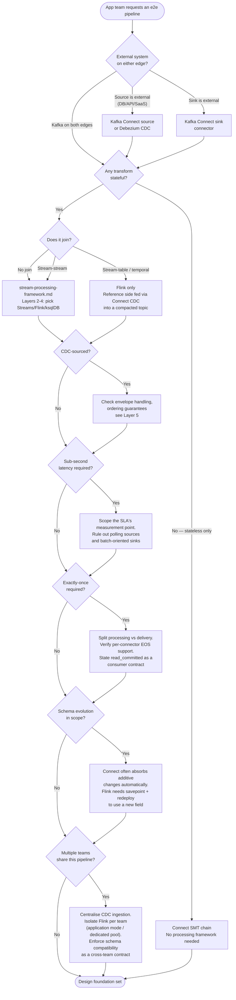

# Kafka Connect vs Flink — Pipeline Boundary Framework

A layered decision path for the question that comes up whenever an app team asks the platform for
an end-to-end pipeline: "fetch data, transform/join it, land it somewhere else." That request is
never actually one decision — it is several, and Kafka Connect and Flink are not competing answers
to it. Connect is the platform's **data integration** boundary (external systems ↔ Kafka). Flink is
the **processing** layer for data already in Kafka. In a real pipeline the two are almost always
chained, not chosen between.

**Relationship to `stream-processing-framework.md`:** that framework assumes data is already
sitting in Kafka and helps you pick a processing framework (Kafka Streams vs Flink vs ksqlDB) once
you're past the stateless/stateful gate. This framework sits one step earlier — it covers the edges
where an external system is involved (a source database, an API, a destination outside Kafka) and
determines which parts of the pipeline are Connect's job before the processing-framework question
even applies.

---

## Layer 1 — Where Does Data Originate and Terminate?

**Q1: Is either edge of the pipeline an external system?**

- **External source** (database, API, SaaS system, files) → Kafka Connect source connector, or
  Debezium CDC if the source is a database's change stream (see
  [10-Operational-Patterns/cdc-debezium.md](10-Operational-Patterns/cdc-debezium.md)). Flink has its
  own CDC connectors that can read a database log directly, bypassing Kafka — but that trades away
  Kafka's durability, replay, and multi-consumer fan-out for one job's private ingestion path.
  Default to Connect unless there's a specific reason to skip Kafka as the interchange.
- **Data already in Kafka on both edges** → no ingestion decision to make, go to Layer 2.
- **External destination** (database, search index, cache, warehouse) → Kafka Connect sink
  connector. **Kafka topic as the destination** → Flink's own Kafka sink is the natural terminus;
  don't route a Flink-to-Kafka hop through Connect.

If both edges are external systems with no Kafka topic in between at all, this isn't a Kafka
pipeline question — it's plain ETL, and Connect/Flink don't apply.

---

## Layer 2 — Is Any Transformation Stateful?

**Q2: Does any step need memory across records?**

Stateless, per-record operations — field rename/mask/drop, type cast, filter, route by header,
flatten a nested structure — never need a processing framework, on either side of the pipeline:

- **Source-side:** a Kafka Connect SMT chain runs before the record is serialised to Kafka.
- **Sink-side:** an SMT chain runs after deserialisation, before the record reaches the destination.

See [05-Enterprise-Connect/single-message-transforms.md](05-Enterprise-Connect/single-message-transforms.md)
for the built-in SMT catalogue and chaining performance.

The moment any operation needs to look at more than one record to produce its output —
aggregation, join, windowing, deduplication, sequence detection — SMTs cannot do it (no state
between invocations). Hand off to Flink (or Kafka Streams / ksqlDB — that selection is
`stream-processing-framework.md`'s job from here, Layers 2 onward).

---

## Layer 3 — Does It Need to Join?

**Q3: Is there a join, and what shape is it?**

Connect genuinely cannot join. SMTs operate on one record with no visibility into any other topic
or record — there is no Connect primitive for combining two data sources.

| Join shape | Owner | Notes |
|---|---|---|
| Stream-to-stream, within a time window | Flink or Kafka Streams | See `stream-processing-framework.md` Layer 2 for the split between them |
| Stream-to-table (temporal / point-in-time lookup against a slowly-changing reference) | Flink, or Kafka Streams with versioned state stores | `stream-processing-framework.md` Layer 2 — Flink's temporal join is native and default; Kafka Streams requires opting into versioned state stores (KIP-889/914) and doesn't support the join for `GlobalKTable` or with `suppress()`. ksqlDB still has no true temporal join. |
| Stream enriched against reference data sourced from a database | Connect (CDC) feeds Flink (join) | See below |

The recurring pattern for the third row: CDC the reference/dimension table into a compacted,
primary-key-keyed Kafka topic via a Connect source connector, then have Flink perform a temporal
join against that topic. Connect's only job in this shape is keeping the reference topic current —
the join itself belongs entirely to Flink.

---

## Layer 4 — Where Does It Land?

**Q4: Single Kafka topic, or fan-out to multiple destinations?**

- **Back into Kafka** → Flink's native `KafkaSink` is the natural terminus for anything continuing
  downstream. This is also the answer when the "sink" is an internal consumer application (a
  real-time dashboard, an internal service) rather than an external system or database: write to
  Kafka once, and let that application consume the topic directly with a Kafka client — no Connect
  or further Flink decision needed on that leg. Only route through a Connect sink connector when the
  destination is genuinely outside Kafka's client model (a database, search index, or external API).
- **Fan-out to several external systems from one processed stream** → land the processed result in
  Kafka once, then run N independent Connect sink connectors off that topic. Don't make a Flink job
  own multiple external-system integrations directly — that re-implements connectors Confluent (or
  the OSS ecosystem) already maintains.
- **Any external sink** → verify its write-path throughput/latency characteristics before
  committing to an SLA — see Layer 6.

---

## Layer 5 — CDC as the Source

Skip this layer if nothing upstream is a database CDC feed. Full Debezium mechanics — WAL/binlog
reading, snapshot modes, replication slot operations — live in
[10-Operational-Patterns/cdc-debezium.md](10-Operational-Patterns/cdc-debezium.md). What's specific
to a Connect+Flink pipeline built on top of that feed:

**Envelope semantics.** Debezium emits a `before`/`after`/`op` envelope, not a flat row. Two ways
to consume it:
- Flatten early with Debezium's `ExtractNewRecordState` ("unwrap") SMT — simplest, but loses the
  `before` image and requires deliberate `delete.handling.mode` configuration or deletes silently
  disappear downstream.
- Keep the raw envelope and let Flink interpret it directly (`'format' = 'debezium-json'` /
  `debezium-avro-confluent`) — necessary if downstream logic needs to know *what changed*, not just
  the current value, or must propagate deletes correctly through a join or aggregation.

**Ordering.** Debezium preserves per-key commit order by default (see "Strict ordering" in
`cdc-debezium.md`). Verify nothing downstream repartitions in a way that breaks it — Flink joins
and aggregations depend on that ordering guarantee for correctness, and a broken guarantee fails
silently rather than erroring.

**Dimension vs. fact.** A CDC feed used as the reference side of a join is exactly the Layer 3
pattern. A CDC feed used as the *primary* stream inherits everything else in this framework
(transform/join/EOS/schema) normally — it just carries change-event semantics instead of plain
records.

---

## Layer 6 — Latency SLA

**Q5: What does the latency number actually measure?**

Scope this before designing to it. "Sub-second" measured as *record lands in Kafka* is something
the platform can commit to. Measured as *visible in the final external system*, it depends on a
system the platform may not control — get this stated explicitly.

Numbers by mechanism are in
[13-Performance-Tuning/end-to-end-latency.md](13-Performance-Tuning/end-to-end-latency.md): Connect's
poll-interval-driven ingestion (1s–60s, no sub-second guarantee by default) vs. Debezium CDC (<10ms
from commit, since it tails the log rather than polling); Flink's per-record processing is
ms-level, but its checkpoint interval (default 10s–5min) is the hard floor on when output becomes
visible under EOS.

Three specific ways a tight latency target breaks silently if not checked:
- A JDBC-**polling** source connector where log-based CDC was assumed — polling has a floor CDC
  doesn't have.
- A **batch-oriented sink connector** (warehouse bulk loaders, bulk-indexing) downstream of an
  otherwise-fast pipeline — the bottleneck moves to the sink's own flush cadence, which Connect/Flink
  tuning cannot fix.
- A **windowed Flink aggregation** — output is definitionally unavailable until the window closes.
  Reconcile "must aggregate AND be low-latency" with early-firing triggers
  (`stream-processing-framework.md` Layer 5), not by shrinking the window past correctness.
- **Sub-second latency combined with full transactional EOS on the same Flink hop.** This is the
  same checkpoint-interval floor as the windowed-aggregation case, for a different reason: under
  `CheckpointingMode.EXACTLY_ONCE`, output is only visible to `read_committed` consumers at
  checkpoint boundaries (10s–5min by default) — see Layer 7. A hop that must be both sub-second
  *and* exactly-once cannot get both from Flink checkpointing alone. Resolve it the way Layer 7
  resolves it generally: reserve transactional EOS for the specific hop where a duplicate causes
  irreversible harm, and use at-least-once plus idempotent processing (dedup on a natural key) for
  the latency-critical hop instead.

---

## Layer 7 — Exactly-Once Delivery

**Q6: Processing guarantee, or end-to-end delivery guarantee?**

These are different claims. Exactly-once *processing* — Flink's internal state stays correct across
failures — is solved: `CheckpointingMode.EXACTLY_ONCE`, done. Exactly-once *delivery*, source
through sink, across independently-operated systems, is the hard part and is connector-specific.

| Stage | Default guarantee | How to strengthen it |
|---|---|---|
| Connect source connector | At-least-once | Only achievable when the specific connector uses an idempotent producer + transactional offset commit together — not all connectors implement this; check per connector. See [05-Enterprise-Connect/managed-connectors.md](05-Enterprise-Connect/managed-connectors.md). |
| Flink → Kafka | At-least-once by default | `KafkaSink` with transactional EOS is mature — but output is only visible at checkpoint boundaries, and only to consumers with `isolation.level=read_committed`. A consumer left on the default `read_uncommitted` silently breaks the guarantee. See [07-Advanced-Reliability/exactly-once-semantics.md](07-Advanced-Reliability/exactly-once-semantics.md). |
| Connect sink connector → external system | At-least-once | Exactly-once *effects* (not literal exactly-once delivery) via idempotent/upsert writes on a natural key: JDBC `insert.mode=upsert`, Elasticsearch doc-ID upserts, offset-derived S3 keys. This is the realistic default for most sinks. |

Reserve true transactional EOS effort for the specific hop where a duplicate causes irreversible
harm (payments, audit records) — everywhere else, at-least-once + idempotent writes achieves the
same observable outcome at lower cost, and is what most sink connectors offer regardless.

---

## Layer 8 — Schema Evolution

**Q7: What happens when the source schema changes while the pipeline is running?**

Schema Registry compatibility modes govern whether a change is even allowed to register — that
part is identical no matter what's downstream; see
[08-Stream-Governance/schema-evolution.md](08-Stream-Governance/schema-evolution.md) for compatibility
modes and safe-vs-breaking change tables. What differs is how Connect and Flink each *react* to an
already-allowed, backward-compatible change once it's live in the topic:

- **Connect absorbs additive changes largely automatically.** A Debezium source wired to
  Avro/Protobuf + Schema Registry registers new schema versions and tags new records as the source
  table evolves — an additive column generally needs no connector restart. Sink connectors are more
  limited: some (notably the JDBC sink, via `auto.evolve`) can `ALTER` the destination table for
  additive, nullable-column changes; column removal, renames, or type changes require a manual
  destination migration regardless of connector support.
- **Flink's schema is fixed for the life of the job.** A running SQL job's `CREATE TABLE` schema
  does not change because the upstream shape changed. With lenient JSON parsing
  (`json.fail-on-missing-field = 'false'`), an additive change won't crash the job — it also won't
  be used until someone stops the job **with a savepoint**, updates the DDL, and restarts from that
  savepoint. That's a deliberate deploy event, not something that happens for free the way it often
  can on the Connect side.

**Net effect:** don't promise an app team live, invisible schema evolution across a pipeline that
includes a Flink stage. The registry may pass the change through silently; the Flink job still
needs a coordinated redeploy to actually use it, and until then it's simply not seeing the new
field — not erroring, just ignoring.

---

## Layer 9 — Multiple Teams Sharing the Pipeline

**Q8: Is this pipeline serving one team, or is the ingestion layer shared across several?**

- **CDC/ingestion centralises, not decentralises.** One Debezium connector per source table,
  platform-owned, fanned out to every consuming team via Kafka's native multi-consumer model —
  never one connector per team against the same source (redundant DB load, redundant
  schema-history bookkeeping).
- **Flink work run *for* a team decentralises — one job per team/use case, not a shared job.** A
  shared job means one team's redeploy, savepoint restart, or bug has multi-team blast radius. On
  self-managed Flink (Kubernetes Operator), this is the concrete choice between **application mode**
  (dedicated JobManager/TaskManagers per job — the safer default once more than one team is
  involved) and **session mode** (shared JobManager and task-slot pool — fine for one team, a
  noisy-neighbour risk once several teams compete for the same slots against different latency
  SLAs). On Confluent Cloud Flink, the equivalent lever is compute pool sizing — a dedicated pool
  per team or SLA tier instead of one shared pool for every workload.
- **A shared enrichment job feeding multiple teams is a different case from either of the above —
  treat it like the CDC/ingestion row, not the per-team row.** The Layer 3 reference-data join
  pattern (CDC a dimension table, Flink joins the primary stream against it) often produces a single
  golden-record topic that several teams then consume independently downstream. That upstream join
  is platform- or single-team-owned infrastructure, not "per team/use case" work — apply the same
  centralize-and-fan-out-via-Kafka reasoning as CDC/ingestion: one job, run in application mode for
  isolation from anything downstream, publishing to a topic every consuming team reads with their
  own consumer group. Per-team decentralization applies to what each team does *with* that shared
  output, not to producing it.
- **Schema compatibility becomes a cross-team contract, not an internal detail.** Enforce
  `BACKWARD` or `FULL_TRANSITIVE` at the registry as a hard guardrail — a breaking change from one
  team is now a production incident for every other team consuming the same shared topic.
- **Mask or filter sensitive fields once, centrally, at the shared ingestion layer** — an SMT on
  the shared Connect connector, or a raw/sanitised topic split — rather than trusting every
  downstream team's own Flink job to filter correctly. One control to audit instead of N. See
  [08-Stream-Governance/pii-tracking.md](08-Stream-Governance/pii-tracking.md).
- **Resource isolation needs explicit enforcement at every shared layer:** per-team Kafka client
  quotas ([13-Performance-Tuning/quota-management.md](13-Performance-Tuning/quota-management.md)),
  and monitoring per-connector resource use on a shared Connect worker cluster so one team's
  high-throughput connector doesn't starve another's task rebalancing.

---

## Additional Scenario — Error Handling

Connect has a first-class DLQ primitive: `errors.tolerance=all` plus
`errors.deadletterqueue.topic.name`, with full failure context (exception, original
topic/partition/offset, pipeline stage) injected into record headers — see
[05-Enterprise-Connect/error-handling-dlq.md](05-Enterprise-Connect/error-handling-dlq.md). Flink has
no equivalent built-in; routing bad records to a DLQ topic is a hand-rolled side-output pattern the
job author implements themselves. If a requirement is purely "isolate and don't lose bad records"
with no other transform complexity involved, that's a point in favour of doing it at the Connect
layer rather than standing up a Flink job whose only purpose is error isolation.

## Additional Scenario — Reprocessing and Backfill

Flink reprocesses cleanly: bounded batch mode (`scan.bounded.mode = 'latest-offset'` or a fixed
range) replays from any retained offset, or a job restarts from an earlier savepoint entirely.
Connect's replay story is narrower — a source connector generally can't "replay" without resetting
its offset via the STOPPED-state REST API (Kafka 3.6+) or, for CDC specifically, forcing a
re-snapshot; see
[05-Enterprise-Connect/managed-connectors.md](05-Enterprise-Connect/managed-connectors.md). If
backfill/replay is a first-class requirement for a given transform, that's a point toward doing the
reprocessable logic in Flink rather than relying on Connect's more limited offset-reset mechanics.

---

## Anti-Pattern Checklist

| Anti-pattern | Signal | Fix |
|---|---|---|
| Building a Flink job for a stateless field-level transform | No aggregation, join, or window — just rename/mask/filter/route | Kafka Connect SMT chain |
| One Debezium connector per consuming team against the same source table | N connectors tailing the same DB log for the same table | One connector, fan out via Kafka's native multi-consumer model |
| Multiple teams sharing one Flink session cluster / compute pool | One team's redeploy or bug takes down another team's processing | Application mode (self-managed) or a dedicated compute pool (Confluent Cloud) per team |
| Promising sub-second latency into a batch-oriented sink connector | Warehouse or bulk-load sink downstream | Scope the SLA to "lands in Kafka," not "queryable in the destination" |
| Assuming a running Flink job "picks up" a new source field automatically | Schema evolved upstream; job keeps running but never uses the new field | Stop with savepoint, update the DDL, restart from that savepoint |
| Trusting every team's own Flink job to mask PII correctly | N independent implementations of the same governance requirement | Mask once, centrally, at the shared Connect ingestion layer |
| Treating "exactly-once" as automatic once Flink checkpointing is enabled | A downstream consumer is still on `isolation.level=read_uncommitted` | State the `read_committed` requirement as an explicit contract to every consumer of the output topic |
| Standing up a Flink job purely for error isolation | No transform logic beyond "don't lose bad records" | Connect DLQ (`errors.tolerance=all`) |

---

## Decision Sequence Summary

---

## Cross-References

- Stateless/stateful gate and processing-framework selection once past this boundary —
  [stream-processing-framework.md](stream-processing-framework.md)
- SMTs, connector lifecycle, delivery guarantees, DLQ —
  [05-Enterprise-Connect/](05-Enterprise-Connect/README.md)
- Debezium CDC mechanics (WAL/binlog reading, snapshot modes, ordering, operational hazards) —
  [10-Operational-Patterns/cdc-debezium.md](10-Operational-Patterns/cdc-debezium.md)
- Latency numbers by mechanism —
  [13-Performance-Tuning/end-to-end-latency.md](13-Performance-Tuning/end-to-end-latency.md)
- Exactly-once protocol, `read_committed`, transaction cost —
  [07-Advanced-Reliability/exactly-once-semantics.md](07-Advanced-Reliability/exactly-once-semantics.md)
- Schema Registry compatibility modes, safe vs breaking changes —
  [08-Stream-Governance/schema-evolution.md](08-Stream-Governance/schema-evolution.md)
- Kafka Streams vs Flink deployment model, state rebuild, EOS mechanism —
  [06-Stream-Processing/kafka-streams-vs-flink.md](06-Stream-Processing/kafka-streams-vs-flink.md)
- Per-tenant quota enforcement — [13-Performance-Tuning/quota-management.md](13-Performance-Tuning/quota-management.md)
- PII masking and crypto-shredding — [08-Stream-Governance/pii-tracking.md](08-Stream-Governance/pii-tracking.md)
- Overall platform decision framework — this file's Layers 1–4 feed directly into the Processing
  Framework dimension there — [decision-framework.md](decision-framework.md)
