# Streaming Platform Design Framework

A general decision framework for any Kafka / Confluent-ecosystem streaming design problem.

**Core idea:** Start with the full solution space — every option on every dimension is valid until a requirement eliminates it. Requirements are filters, not guidance. What survives the filter pass is your design foundation. "Platform" is an output of the scale requirements, not an assumption you walk in with.

**Scope:** Kafka and Confluent Platform / Confluent Cloud. Not intended to generalise across Pulsar, Kinesis, or other streaming technologies.

---

## Decision Flow

```mermaid
flowchart TD
    PS([Problem Statement]) --> EXTRACT["Extract hard requirements\n— compliance · SLA · scale · infrastructure · data lifecycle"]

    EXTRACT --> SPACE

    subgraph SPACE [Full Solution Space — All Paths Open]
        direction LR

        subgraph INFRA_DIM [Infrastructure]
            OSS["OSS Kafka\nself-managed"]
            CP["Confluent Platform\nself-managed"]
            CC["Confluent Cloud\nfully managed"]
            HYB["Hybrid\non-prem + cloud"]
        end

        subgraph DEL_DIM [Delivery Guarantee]
            AMO["At-most-once\nno producer retries"]
            ALO["At-least-once\nidempotent consumers required"]
            EOS["Exactly-once\nidempotent + transactional"]
        end

        subgraph ERA_DIM [Data Erasure]
            NONE_E["No erasure\nneeded"]
            TOMB["Tombstone records\ncompaction removes data"]
            DEL_T["Topic deletion\nall data gone"]
            CRYS["Crypto-shredding\nper-entity DEK in KMS"]
        end

        subgraph DR_DIM [Disaster Recovery]
            NO_DR["No DR\naccept data loss on failure"]
            MM2["MirrorMaker 2\nOSS · minutes RPO · offset translation"]
            CL["Cluster Linking\nConfluent · sub-60s RPO · byte-exact"]
            AA["Active-active\nbidirectional · conflict resolution required"]
        end

        subgraph AUTH_DIM [Authentication]
            PLAINTEXT["No auth / PLAINTEXT\ndevelopment only"]
            SASL["SASL/PLAIN\nshared credential"]
            MTLS["mTLS\nper-service certificate"]
            OAUTH["OAuth/OIDC\nCEL Identity Pools"]
        end

        subgraph SCHEMA_DIM [Schema Governance]
            NO_SCH["No Schema Registry\nuntyped byte arrays"]
            NONE_C["NONE compatibility\nno checks"]
            BACK_FWD["BACKWARD or FORWARD\nper-subject checks"]
            FULL_T["FULL_TRANSITIVE\nCI/CD gate · no auto-register"]
        end

        subgraph ISOL_DIM [Tenant Isolation]
            NO_ISO["None\nsingle team, trusted producers"]
            SOFT["Soft\nobservability only, no enforcement"]
            HARD["Hard\nquotas per user principal + client-id"]
        end

        subgraph RET_DIM [Retention]
            SHORT["Short\nhours to days"]
            MED["Medium\nweeks to months"]
            LONG["Long\nyears via tiered storage"]
        end

        subgraph PROC_DIM [Processing Framework]
            NO_PROC["None\nconsumers process directly"]
            KSQL["ksqlDB\nSQL interface · persistent queries"]
            KS["Kafka Streams\nJVM embedded · co-deployed"]
            FLINK["Apache Flink\nindependent cluster · large state"]
        end
    end

    SPACE --> FILTER

    subgraph FILTER [Apply Requirements as Filters]
        direction TB
        F1["For each requirement, ask:\n1. Which dimension does this touch?\n2. Which options on that dimension does it eliminate?\n3. Which option does it mandate — or does a choice remain?"]
        F2["Compliance requirement\nexample: GDPR right-to-erasure\n→ ERA_DIM: eliminates NONE_E · TOMB · DEL_T\n→ mandates CRYS"]
        F3["Delivery requirement\nexample: Exactly-once for payments\n→ DEL_DIM: eliminates AMO · ALO on critical paths\n→ mandates EOS"]
        F4["Infrastructure constraint\nexample: Confluent Cloud only\n→ INFRA_DIM: eliminates OSS · CP · HYB\n→ mandates CC"]
        F5["SLA requirement\nexample: RPO under 60 seconds\n→ DR_DIM: eliminates NO_DR · MM2\n→ mandates CL or AA · choice remains"]
        F6["Scale requirement\nexample: 1000+ services · 100+ developers\n→ AUTH_DIM: eliminates PLAINTEXT · SASL\n→ mandates MTLS or OAUTH · choice remains\n→ ISOL_DIM: eliminates NO_ISO · SOFT\n→ mandates HARD\n→ SCHEMA_DIM: eliminates NO_SCH · NONE_C\n→ mandates FULL_T"]
        F1 --> F2 --> F3 --> F4 --> F5 --> F6
    end

    FILTER --> CLASSIFY

    subgraph CLASSIFY [Classify Each Dimension After All Filters]
        direction LR
        MAN["MANDATED\nOne option survives on this dimension\nNo design decision remains — this is fixed"]
        OPEN["OPEN\nMultiple options survive\nStill a design decision — choose based on preference or cost"]
        ELIM["ELIMINATED\nNo valid options on this dimension\nRequirements are contradictory — revisit the problem statement"]
    end

    CLASSIFY --> EMERGE

    EMERGE{"Does the surviving\nISOL_DIM = HARD?\n\nAnd AUTH_DIM requires\nper-service identity?"}
    EMERGE -->|"Yes — scale requirements survived the filter\nThis is a platform problem"| PLATFORM
    EMERGE -->|"No — single team, bounded scope\nThis is a system problem"| SYSTEM

    PLATFORM["Platform design\nAdd: ownership boundary between platform team and tenant teams\nPlatform team owns: mandated selections + enforcement\nTenant teams own: OPEN dimension choices within guardrails"]

    SYSTEM["System design\nAll OPEN dimensions are decided by one team\nNo quota enforcement · simpler auth · lighter governance"]

    PLATFORM --> CASCADE
    SYSTEM --> CASCADE

    CASCADE["Resolve OPEN dimensions\nFor each remaining open dimension:\n→ What does each surviving option optimise for?\n→ What does it sacrifice?\n→ Which surviving option fits the remaining context?"]

    CASCADE --> DONE(["Design foundation set\nDocument mandated selections · document open choices made · iterate per topic and service"])
```

---

## How to Read This

**The solution space** shows every option that exists on every relevant design dimension. Before you read a single requirement, all of them are valid.

**The filter pass** applies each requirement to the solution space. A requirement is not a preference — it eliminates options. If a requirement says "GDPR right-to-erasure applies", then tombstones are not a tradeoff to consider. They are gone.

**Classify each dimension after all filters:**
- **MANDATED** — one option survives, no decision to make, it is fixed
- **OPEN** — multiple options survive, you still have a choice to make on this dimension
- **ELIMINATED** — no options survive, your requirements are contradictory, go back to the problem statement

**"Platform" emerges — it is not assumed.** If the scale requirements (hundreds of services, independent teams) survive the filter, then hard tenant isolation is mandated and per-service authentication is mandated. That combination is what makes something a platform design problem. If those requirements are not present, it remains a system design problem with simpler auth and no quota enforcement.

**OPEN dimensions become your actual design decisions** — the interesting ones where tradeoffs apply. Everything that is MANDATED is not a tradeoff. Do not spend time debating mandated choices.

---

## Key Eliminations Reference

| Requirement | Dimension | Eliminates | Mandates |
|---|---|---|---|
| GDPR right-to-erasure | Data Erasure | No erasure · Tombstones · Topic deletion | Crypto-shredding per entity |
| Immutable audit trail | Schema Governance, Retention | NONE compatibility | FULL_TRANSITIVE · Long retention |
| PCI-DSS sensitive data | Authentication, Schema | PLAINTEXT · SASL/PLAIN | mTLS or OAuth/OIDC · Field encryption |
| Exactly-once on critical path | Delivery Guarantee | At-most-once · At-least-once | Exactly-once |
| RPO < 60 seconds | Disaster Recovery | No DR · MirrorMaker 2 | Cluster Linking |
| Cloud-managed only | Infrastructure | OSS self-managed · Confluent Platform self-managed | Confluent Cloud |
| Retention > 30 days | Retention | Short | Long via Tiered Storage + delete policy |
| 1000+ services, independent teams | Tenant Isolation · Auth | No isolation · Soft isolation · Shared credentials | Hard quotas · mTLS or OAuth/OIDC |
| Shared platform, independent teams | Schema Governance | No Schema Registry · NONE · auto-register | FULL_TRANSITIVE + CI/CD gate |
| Multi-event types + ksqlDB/Flink | Schema Governance | RecordNameStrategy · TopicRecordNameStrategy | TopicNameStrategy + union type |

---

## Cross-References

Each dimension in this framework maps to a detailed module in the guide:

- Data Erasure / crypto-shredding → [08-Stream-Governance/pii-tracking.md](08-Stream-Governance/pii-tracking.md)
- Schema Governance / compatibility modes → [08-Stream-Governance/schema-evolution.md](08-Stream-Governance/schema-evolution.md)
- Delivery Guarantee / exactly-once → [07-Advanced-Reliability/exactly-once-semantics.md](07-Advanced-Reliability/exactly-once-semantics.md)
- Authentication / mTLS / OAuth / CEL → [09-Security-Architecture/](09-Security-Architecture/)
- Disaster Recovery / Cluster Linking vs MirrorMaker 2 → [12-Multi-Region-DR/](12-Multi-Region-DR/)
- Tenant Isolation / quota management → [13-Performance-Tuning/quota-management.md](13-Performance-Tuning/quota-management.md)
- Retention / Tiered Storage → [02-Broker-Infrastructure/tiered-storage.md](02-Broker-Infrastructure/tiered-storage.md)
- Processing Framework / ksqlDB vs Kafka Streams vs Flink → [06-Stream-Processing/kafka-streams-vs-flink.md](06-Stream-Processing/kafka-streams-vs-flink.md)
- Producer / consumer / broker tuning → [13-Performance-Tuning/](13-Performance-Tuning/)
