# Streaming Platform Design Framework

A general decision framework for any Kafka / Confluent-ecosystem streaming design problem.

**Core idea:** Start with the full solution space — every option on every dimension is valid until a requirement eliminates it. Requirements are filters, not guidance. What survives the filter pass is your design foundation. "Platform" is an output of the scale requirements, not an assumption you walk in with.

**Scope:** Kafka and Confluent Platform / Confluent Cloud. Not intended to generalise across Pulsar, Kinesis, or other streaming technologies.

**Before this:** if the requirements aren't crisp yet — an ambiguous problem statement, an interview prompt, a stakeholder ask with unstated constraints — work through [streaming-design-approach.md](streaming-design-approach.md) first. It covers the discovery questions that turn an ambiguous ask into the hard requirements this framework filters against. This framework assumes those requirements are already in hand.

---

## Decision Flow

```mermaid
flowchart TD
    PS([Problem Statement]) --> EXTRACT["Extract hard requirements\n— compliance · SLA · scale · infrastructure · data lifecycle"]

    EXTRACT --> SPACE

    subgraph SPACE [Full Solution Space — All Paths Open]
        direction LR

        subgraph INFRA_DIM [Infrastructure]
            OSS["OSS Kafka\nself-managed"]
            CP["Confluent Platform\nself-managed"]
            CC["Confluent Cloud\nfully managed"]
            HYB["Hybrid\non-prem + cloud"]
        end

        subgraph DEL_DIM [Delivery Guarantee]
            AMO["At-most-once\nno producer retries"]
            ALO["At-least-once\nidempotent consumers required"]
            EOS["Exactly-once\nidempotent + transactional"]
        end

        subgraph ERA_DIM [Data Erasure]
            NONE_E["No erasure\nneeded"]
            TOMB["Tombstone records\ncompaction removes data"]
            DEL_T["Topic deletion\nall data gone"]
            CRYS["Crypto-shredding\nper-entity DEK in KMS"]
        end

        subgraph DR_DIM [Disaster Recovery]
            NO_DR["No DR\naccept data loss on failure"]
            MM2["MirrorMaker 2\nOSS · minutes RPO · offset translation"]
            CL["Cluster Linking\nConfluent · sub-60s RPO · byte-exact"]
            AA["Active-active\nbidirectional · conflict resolution required"]
        end

        subgraph AUTH_DIM [Authentication]
            PLAINTEXT["No auth / PLAINTEXT\ndevelopment only"]
            SASL["SASL/PLAIN\nshared credential"]
            MTLS["mTLS\nper-service certificate"]
            OAUTH["OAuth/OIDC\nCEL Identity Pools"]
        end

        subgraph SCHEMA_DIM [Schema Governance]
            NO_SCH["No Schema Registry\nuntyped byte arrays"]
            NONE_C["NONE compatibility\nno checks"]
            BACK_FWD["BACKWARD or FORWARD\nper-subject checks"]
            FULL_T["FULL_TRANSITIVE\nCI/CD gate · no auto-register"]
        end

        subgraph ISOL_DIM [Tenant Isolation]
            NO_ISO["None\nsingle team, trusted producers"]
            SOFT["Soft\nobservability only, no enforcement"]
            HARD["Hard\nquotas per user principal + client-id"]
        end

        subgraph RET_DIM [Retention]
            SHORT["Short\nhours to days"]
            MED["Medium\nweeks to months"]
            LONG["Long\nyears via tiered storage"]
        end

        subgraph PROC_DIM [Processing Framework]
            NO_PROC["None\nconsumers process directly"]
            KSQL["ksqlDB\nSQL interface · persistent queries"]
            KS["Kafka Streams\nJVM embedded · co-deployed"]
            FLINK["Apache Flink\nindependent cluster · large state"]
        end
    end

    SPACE --> FILTER

    subgraph FILTER [Apply Requirements as Filters]
        direction TB
        F1["For each requirement, ask:\n1. Which dimension does this touch?\n2. Which options on that dimension does it eliminate?\n3. Which option does it mandate — or does a choice remain?"]
        F2["Compliance requirement\nexample: GDPR right-to-erasure\n→ ERA_DIM: eliminates NONE_E · TOMB · DEL_T\n→ mandates CRYS"]
        F3["Delivery requirement\nexample: Exactly-once for payments\n→ DEL_DIM: eliminates AMO · ALO on critical paths\n→ mandates EOS"]
        F4["Infrastructure constraint\nexample: Confluent Cloud only\n→ INFRA_DIM: eliminates OSS · CP · HYB\n→ mandates CC"]
        F5["SLA requirement\nexample: RPO under 60 seconds\n→ DR_DIM: eliminates NO_DR · MM2\n→ mandates CL or AA · choice remains"]
        F6["Organizational scale requirement\nexample: 1000+ services · 100+ developers\n→ AUTH_DIM: eliminates PLAINTEXT · SASL\n→ mandates MTLS or OAUTH · choice remains\n→ ISOL_DIM: eliminates NO_ISO · SOFT\n→ mandates HARD\n→ SCHEMA_DIM: eliminates NO_SCH · NONE_C\n→ mandates FULL_T\n(for throughput/capacity growth rate, see Cross-References)"]
        F1 --> F2 --> F3 --> F4 --> F5 --> F6
    end

    FILTER --> CLASSIFY

    subgraph CLASSIFY [Classify Each Dimension After All Filters]
        direction LR
        MAN["MANDATED\nOne option survives on this dimension\nNo design decision remains — this is fixed"]
        OPEN["OPEN\nMultiple options survive\nStill a design decision — choose based on preference or cost"]
        ELIM["ELIMINATED\nNo valid options on this dimension\nRequirements are contradictory — revisit the problem statement"]
    end

    CLASSIFY --> EMERGE

    EMERGE{"Does the surviving\nISOL_DIM = HARD?\n\nAnd AUTH_DIM requires\nper-service identity?"}
    EMERGE -->|"Yes — scale requirements survived the filter\nThis is a platform problem"| PLATFORM
    EMERGE -->|"No — single team, bounded scope\nThis is a system problem"| SYSTEM

    PLATFORM["Platform design\nAdd: ownership boundary between platform team and tenant teams\nPlatform team owns: mandated selections + enforcement\nTenant teams own: OPEN dimension choices within guardrails"]

    SYSTEM["System design\nAll OPEN dimensions are decided by one team\nNo quota enforcement · simpler auth · lighter governance"]

    PLATFORM --> CASCADE
    SYSTEM --> CASCADE

    CASCADE["Resolve OPEN dimensions\nFor each remaining open dimension:\n→ What does each surviving option optimise for?\n→ What does it sacrifice?\n→ Which surviving option fits the remaining context?"]

    CASCADE --> DONE(["Design foundation set\nDocument mandated selections · document open choices made · iterate per topic and service"])
```

---

## How to Read This

**The solution space** shows every option that exists on every relevant design dimension. Before you read a single requirement, all of them are valid.

**The filter pass** applies each requirement to the solution space. A requirement is not a preference — it eliminates options. If a requirement says "GDPR right-to-erasure applies", then tombstones are not a tradeoff to consider. They are gone.

**Classify each dimension after all filters:**
- **MANDATED** — one option survives, no decision to make, it is fixed
- **OPEN** — multiple options survive, you still have a choice to make on this dimension
- **ELIMINATED** — no options survive, your requirements are contradictory, go back to the problem statement

**"Platform" emerges — it is not assumed.** If the scale requirements (hundreds of services, independent teams) survive the filter, then hard tenant isolation is mandated and per-service authentication is mandated. That combination is what makes something a platform design problem. If those requirements are not present, it remains a system design problem with simpler auth and no quota enforcement.

**OPEN dimensions become your actual design decisions** — the interesting ones where tradeoffs apply. Everything that is MANDATED is not a tradeoff. Do not spend time debating mandated choices.

---

## Dimension Elimination Map

For each option on each dimension: what kills it, and what lets it survive. Use this when you have a specific option in mind and need to check whether any of your requirements rule it out — or when you want to understand the full elimination logic for a dimension before deciding.

---

### Infrastructure

| Option | Eliminated when | Survives when |
|---|---|---|
| **OSS Kafka self-managed** | Cloud-managed is required; Confluent-only features needed (Cluster Linking, managed Flink, CC-native Tiered Storage); no ops team to manage brokers | Team can manage brokers; OSS feature set is sufficient; cost sensitivity rules out licensing |
| **Confluent Platform self-managed** | Cloud-managed is required; no on-prem infrastructure budget; CC-only features are required | On-prem data residency mandated; Confluent features needed but not CC; existing data centre |
| **Confluent Cloud** | Data residency must stay on-prem; airgapped network; regulatory prohibition on cloud storage; latency to cloud is unacceptable for the SLA | No ops team; cloud-native org; need managed Flink, Cluster Linking, or CC-native Tiered Storage |
| **Hybrid** | "Cloud-managed only" hard constraint; "no on-prem infrastructure" constraint; complexity budget exhausted; single cluster topology mandated | Incremental migration from on-prem; some data must stay on-prem by regulation while other data can move to cloud |

---

### Delivery Guarantee

| Option | Eliminated when | Survives when |
|---|---|---|
| **At-most-once** | Any data loss is unacceptable; financial, audit, or transactional data is involved; consumer cannot tolerate missing events | Metrics, telemetry, or log events where occasional loss is acceptable; fire-and-forget notifications |
| **At-least-once** | Exactly-once is required and idempotent consumer design is not feasible; cross-partition atomicity required; duplicate processing causes irreversible business harm (double-credit, double-debit) | Consumer can handle duplicates; no cross-partition atomicity needed; deduplication logic is in place |
| **Exactly-once** | Ultra-high throughput at the lowest possible latency is required and EOS overhead is measurable and unacceptable; use case does not involve state mutation; cross-partition atomicity is not needed | Payment events; financial transactions; audit records; any event where duplicates cause irreversible business harm |

---

### Data Erasure

| Option | Eliminated when | Survives when |
|---|---|---|
| **No erasure needed** | Any personal data (PII) stored in events; GDPR, HIPAA, or any regulation requiring individual record deletion applies | Pure operational or technical data with no PII or sensitive fields |
| **Tombstone records** | GDPR right-to-erasure applies — compaction does not guarantee removal timing; data must be immediately unreadable after erasure; multiple consumer groups with different lag exist on the topic | Key-based deduplication on non-PII data; log compaction for latest-value semantics; team owns all consumers and lag is bounded |
| **Topic deletion** | Granular per-entity erasure required; topic is multi-tenant (deleting it removes other entities' data too); regulatory audit trail must be preserved for other records on the same topic | Ephemeral topics; dev/test; full topic lifecycle is owned by one team; all records on the topic belong to the same entity being erased |
| **Crypto-shredding** | No KMS infrastructure available; cost of per-entity DEK management is prohibitive; data contains no PII or sensitive fields | GDPR right-to-erasure; HIPAA; any regulation requiring individual record erasure without destroying surrounding records |

---

### Disaster Recovery

| Option | Eliminated when | Survives when |
|---|---|---|
| **No DR** | Any RPO < ∞ required; regulatory requirement for data durability; SLA commitment to end users; stateful stream processing state must survive regional failure | Dev/test environments; ephemeral streams where source can replay; no SLA commitment |
| **MirrorMaker 2** | RPO < 5 minutes required; offset-preserving consumer group failover required; Confluent is the primary cluster (Cluster Linking is preferred when available); active-active writes required | OSS-only constraint (no Confluent license); RPO of minutes is acceptable; cross-cloud vendor replication where Cluster Linking is unavailable |
| **Cluster Linking** | OSS-only constraint (Confluent license required); self-managed OSS Kafka without Confluent Platform; active-active bidirectional replication with conflict resolution required | RPO < 60s; Confluent Cloud or Platform in use; offset-exact consumer group failover required; byte-exact topic mirror required |
| **Active-active** | Read-only DR is acceptable; event ordering must be globally total across regions; conflict resolution logic cannot be implemented for the domain; RPO = 0 is not required | Geo-distributed writes required; latency SLA mandates writes to local region; no global ordering guarantee needed; conflict resolution is tractable |

---

### Authentication

| Option | Eliminated when | Survives when |
|---|---|---|
| **No auth / PLAINTEXT** | Any production deployment; shared network; regulatory compliance scope applies; audit trail of client identity required | Local development and isolated single-machine testing only |
| **SASL/PLAIN shared credential** | Hundreds of distinct service identities; per-service audit trail required; credential rotation at scale is impractical; one compromised credential would expose all services | Small team; single trusted service; internal-only deployment; credential rotation is manageable |
| **mTLS per service** | PKI infrastructure does not exist and there is no plan to build it; very high service churn makes certificate lifecycle impractical | Per-service identity required; PKI infrastructure exists; long-lived services; regulatory requirement for mutual authentication |
| **OAuth/OIDC + CEL Identity Pools** | No identity provider (IdP) available; simple team structure where per-service certs are sufficient; CEL expression complexity is not justified | Fine-grained dynamic authorisation needed; IdP already exists (Okta, Azure AD, etc.); ACL logic must change without redeployment; federated identity across multiple orgs |

---

### Schema Governance

| Option | Eliminated when | Survives when |
|---|---|---|
| **No Schema Registry** | Multiple independent producers or consumers exist; schema evolution is expected; consumer failures from schema mismatch are unacceptable; wire format must be auditable | Single producer and single consumer; prototype; no schema evolution planned; binary format managed entirely outside Kafka |
| **NONE compatibility** | Multiple teams share the same topic; production shared platform; schema breakage would affect consumers the producer team does not own | Active development; single team owns all producers and consumers; topic is not shared; schema is stable and rarely changes |
| **BACKWARD / FORWARD** | Hard requirement that any historical consumer version can read any data version (transitive guarantee needed); consumer lag is unbounded — consumers may be many versions behind | Known bounded consumer lag; team controls the release cycle of all producers and consumers; non-transitive guarantee is acceptable |
| **FULL_TRANSITIVE + CI/CD gate** | Rapid iteration where the schema gate slows development velocity intolerably; single team owns all producers and consumers; topic is ephemeral or dev-only | Shared platform; multiple independent teams; consumer lag is unbounded; regulatory schema audit required; a breaking schema change already caused a production incident |

---

### Tenant Isolation

| Option | Eliminated when | Survives when |
|---|---|---|
| **None — single team** | Multiple teams share the cluster; different SLA tiers exist across workloads (payment processing vs analytics); one team's misbehaviour can starve another team's consumers | Single team, single cluster, all workloads equally prioritised, all services trusted |
| **Soft — observability only** | One team's misbehaviour can cause another team's SLA breach; regulatory requirement for resource isolation; platform SLA is committed to individual tenants | Teams are trusted; SLA differences are minor; enforcement overhead is not justified; monitoring is sufficient for the organisational culture |
| **Hard — quotas per user principal + client-id** | Single team; all services equally trusted; overhead of quota management is not justified; no SLA differentiation across workloads | Multiple teams; different SLA tiers; shared platform with committed per-tenant SLAs; a noisy-neighbour incident already occurred |

---

### Retention

| Option | Eliminated when | Survives when |
|---|---|---|
| **Short — hours to days** | Consumer lag may exceed retention window (slow consumers would lose events); audit or regulatory retention required; new consumers need to replay from beginning; event sourcing pattern in use | Pure operational events; consumers always current; no replay needed; source system can re-emit if needed |
| **Medium — weeks to months** | Regulatory multi-year retention required; cost of local storage for this volume over months is prohibitive; new consumer onboarding requires full historical replay beyond months | Most operational use cases; no long-term regulatory requirement; consumer onboarding window fits within weeks |
| **Long — years via tiered storage** | Topic uses compaction (`cleanup.policy=compact`) — tiered storage requires delete policy and the two are incompatible; tiered storage not available on chosen infrastructure; read latency of cold tier is unacceptable for the access pattern | Regulatory multi-year retention; audit logs; financial records; event sourcing with a long replay horizon; local storage cost for years of data is prohibitive |

---

### Processing Framework

| Option | Eliminated when | Survives when |
|---|---|---|
| **None — consumers process directly** | Stateful aggregations required; windowing over event time required; stream-to-stream joins required; aggregation state must survive consumer restart | Simple filtering, routing, or enrichment; consumers process events independently; no cross-event state needed |
| **ksqlDB** | `RecordNameStrategy` or `TopicRecordNameStrategy` is in use — ksqlDB cannot resolve schema; state scale exceeds single ksqlDB node; complex custom logic is not expressible in SQL; independent deployment and scaling of processing required | SQL-familiar team; simple aggregations, filters, and joins; rapid prototyping; team does not want to operate a separate processing cluster |
| **Kafka Streams** | Processing must be independently deployed and scaled from the application; state scale exceeds single JVM; team is not JVM-based; cross-domain joins across unrelated topic owners | JVM team; co-deployment of processor with producer/consumer is acceptable; simple to medium state scale; tight coupling to Kafka lifecycle is acceptable |
| **Apache Flink** | Simple aggregations only — Flink cluster overhead not justified; no Flink operational expertise; Kafka Streams is sufficient for the state size and topology | Large state (TBs of keyed state); complex event patterns (CEP); unified batch and stream processing; independent scaling of processing from Kafka; cross-domain joins; team already operates Flink |

---

## Key Eliminations Reference

| Requirement | Dimension | Eliminates | Mandates |
|---|---|---|---|
| GDPR right-to-erasure | Data Erasure | No erasure · Tombstones · Topic deletion | Crypto-shredding per entity |
| Immutable audit trail | Schema Governance, Retention | NONE compatibility | FULL_TRANSITIVE · Long retention |
| PCI-DSS sensitive data | Authentication, Schema | PLAINTEXT · SASL/PLAIN | mTLS or OAuth/OIDC · Field encryption |
| Exactly-once on critical path | Delivery Guarantee | At-most-once · At-least-once | Exactly-once |
| RPO < 60 seconds | Disaster Recovery | No DR · MirrorMaker 2 | Cluster Linking |
| Cloud-managed only | Infrastructure | OSS self-managed · Confluent Platform self-managed | Confluent Cloud |
| Retention > 30 days | Retention | Short | Long via Tiered Storage + delete policy |
| 1000+ services, independent teams | Tenant Isolation · Auth | No isolation · Soft isolation · Shared credentials | Hard quotas · mTLS or OAuth/OIDC |
| Shared platform, independent teams | Schema Governance | No Schema Registry · NONE · auto-register | FULL_TRANSITIVE + CI/CD gate |
| Multi-event types + ksqlDB/Flink | Schema Governance | RecordNameStrategy · TopicRecordNameStrategy | TopicNameStrategy + union type |

---

## Cross-References

Each dimension in this framework maps to a detailed module in the guide:

- Data Erasure / crypto-shredding → [08-Stream-Governance/pii-tracking.md](08-Stream-Governance/pii-tracking.md)
- Schema Governance / compatibility modes → [08-Stream-Governance/schema-evolution.md](08-Stream-Governance/schema-evolution.md)
- Delivery Guarantee / exactly-once → [07-Advanced-Reliability/exactly-once-semantics.md](07-Advanced-Reliability/exactly-once-semantics.md)
- Authentication / mTLS / OAuth / CEL → [09-Security-Architecture/](09-Security-Architecture/)
- Disaster Recovery / Cluster Linking vs MirrorMaker 2 → [12-Multi-Region-DR/](12-Multi-Region-DR/)
- Tenant Isolation / quota management → [13-Performance-Tuning/quota-management.md](13-Performance-Tuning/quota-management.md)
- Retention / Tiered Storage → [02-Broker-Infrastructure/tiered-storage.md](02-Broker-Infrastructure/tiered-storage.md)
- Topic topology (ordering, joins, isolation, partition count, naming) — the layered path behind the Retention and Tenant Isolation dimensions above → [topic-design-framework.md](topic-design-framework.md)
- Processing Framework / ksqlDB vs Kafka Streams vs Flink → [06-Stream-Processing/kafka-streams-vs-flink.md](06-Stream-Processing/kafka-streams-vs-flink.md)
- Processing Framework / where Kafka Connect hands off to Flink for pipelines touching an external system → [connect-vs-flink-framework.md](connect-vs-flink-framework.md)
- Processing Framework / one pipeline or two — Lambda vs Kappa vs the Data Streaming Platform model, the decision one level above the Kafka Streams/Flink/ksqlDB choice → [01-Core-Concepts/lambda-vs-kappa-vs-streaming-platform.md](01-Core-Concepts/lambda-vs-kappa-vs-streaming-platform.md)
- Producer / consumer / broker tuning → [13-Performance-Tuning/](13-Performance-Tuning/)
- Throughput/capacity growth rate (distinct from the organizational scale in F6 above) — the repeatable resize cadence for compounding growth → [13-Performance-Tuning/capacity-scaling-cadence.md](13-Performance-Tuning/capacity-scaling-cadence.md)
