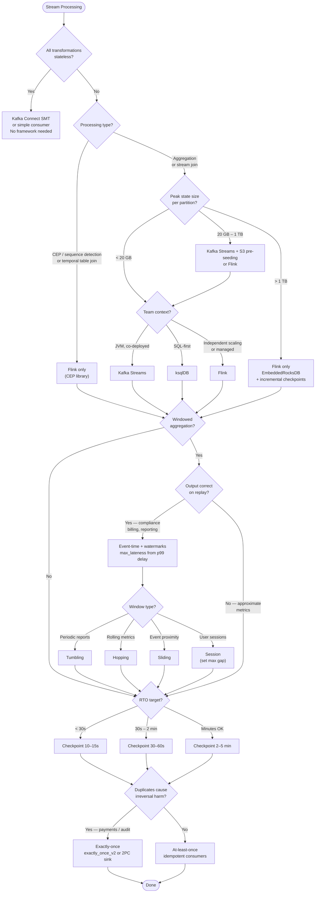

# Stream Processing Design Framework

A layered decision path for selecting and configuring a stream processing framework. Work through the layers in order — each layer's answer eliminates options or constrains the next. Do not start with framework selection before establishing whether processing is stateful and what kind of state is involved.

The most common mistake is reaching for Flink or Kafka Streams before confirming that stream processing is needed at all.

---

## Layer 1 — Is Stream Processing Required?

### Q1: Are all transformations stateless?

Stateless operations — field masking, format conversion, routing, enrichment from a static reference — do not require a stream processing framework:

- **Kafka Connect SMTs** handle field-level transforms at the connector without a separate processing cluster
- **A lightweight consumer loop** handles stateless per-record enrichment and conditional routing

If all transformations are stateless → stop here. Use SMTs or a simple consumer. No framework needed.

If any transformation requires memory across records — aggregation, join, pattern detection — continue to Layer 2.

---

## Layer 2 — Type of Processing

### Q2: What does the processing actually need to do?

This question determines framework eligibility before state size or team context matter. Some processing types eliminate frameworks unconditionally.

| Processing need | Eligible | Eliminated |
|---|---|---|
| Count / sum / average per key over a time window | ksqlDB · Kafka Streams · Flink | — |
| Join stream to a slowly-changing reference table | ksqlDB · Kafka Streams · Flink | — |
| Join two event streams within a time window | Kafka Streams · Flink | ksqlDB (very limited) |
| Detect a sequence of events over time (CEP) | **Flink only** (CEP library) | ksqlDB · Kafka Streams |
| Temporal table join / point-in-time lookup | **Flink only** | Kafka Streams · ksqlDB |
| Pull-query access to materialised current state | ksqlDB · Kafka Streams (interactive queries) | Flink (no native pull query) |
| SQL-based processing, no JVM application code | ksqlDB · Flink SQL | Kafka Streams |

CEP and temporal joins eliminate everything except Flink immediately — do not continue evaluating the other frameworks if either of these is required.

---

## Layer 3 — State Size

### Q3: How large is the keyed state at peak load?

State size determines recovery time on failure, not just resource allocation. The threshold is not about memory — it is about how long a restart takes before the instance can process new records.

| State size | Recovery behaviour | Viable frameworks |
|---|---|---|
| < ~20 GB per partition | Kafka Streams changelog replay completes in < 10 min | Kafka Streams · Flink |
| 20 GB – 1 TB | Changelog replay takes 45 min – 2 hours; S3 pre-seeding required to make it tolerable | Kafka Streams + S3 pre-seeding · Flink |
| > 1 TB | Changelog replay is impractical regardless of pre-seeding | **Flink only** with `EmbeddedRocksDBStateBackend` + incremental checkpoints |

The 20 GB boundary is not a hard line — it is the point where changelog replay starts causing consumer lag accumulation long enough to matter operationally. A 30 GB store that can be restored from an S3 snapshot in 90 seconds (S3 pre-seeding) is operationally equivalent to a 5 GB store. A 30 GB store rebuilding over Kafka replay for 75 minutes is not.

For Flink, state size also determines the state backend:

| State size | Backend | Why |
|---|---|---|
| < a few GB | `HashMapStateBackend` (heap) | No serialisation overhead; lowest read/write latency |
| > a few GB | `EmbeddedRocksDBStateBackend` | Survives JVM memory limits; enables incremental checkpoints |

See `06-Stream-Processing/state-management.md` for RocksDB tuning and `10-Operational-Patterns/rocksdb-s3-preseeding.md` for the S3 pre-seeding pattern.

---

## Layer 4 — Team and Operational Context

### Q4: What is the team's language, deployment model, and operational preference?

At this point, Layer 2 has determined which frameworks are eligible for the processing type, and Layer 3 has constrained by state scale. Apply team context to make the final selection among what remains.

| Context | Best fit | Reason |
|---|---|---|
| JVM team; processing co-deployed with the application | Kafka Streams | Embedded library; no cluster to operate; same CI/CD, same monitoring stack |
| SQL-first team; simple aggregations; no JVM | ksqlDB | No application code; declarative SQL interface; rapid iteration |
| Processing must scale independently from the application | Flink | Separate cluster; parallelism and resource allocation decoupled from app |
| Confluent Cloud; want fully managed processing | Confluent Cloud Flink | No cluster operations; native Schema Registry integration; CFU-based scaling |
| Python / data engineering team; analytical pipelines | Flink (PyFlink / Flink SQL) | JVM not required; SQL interface covers most analytical patterns |

**Kafka Streams co-deployment is a constraint, not just a preference.** If the processing logic needs a different scaling profile from the application — different throughput, different failure domain, different deployment cadence — then Kafka Streams embedded in the app is the wrong choice regardless of state size. A stream processor that must be restarted every time the application deploys is not independent.

---

## Layer 5 — Time Semantics (Windowed Jobs Only)

Skip this layer entirely if the job does not aggregate across time windows.

### Q5: Does the aggregation need to be correct for out-of-order or late-arriving events?

**Processing-time:** window boundaries defined by the processor's wall clock when a record is received. Simple to implement — no coordination or timestamp extraction required. Non-deterministic: the same events replayed at a different time produce different window assignments. A consumer catching up from lag assigns late-arriving events to incorrect windows.

**Event-time:** window boundaries defined by a timestamp in the event payload. Deterministic: replaying the same events always produces the same result. Requires watermarks to signal when a window is complete.

**Rule:** if the output drives reporting, compliance checks, SLA measurement, billing, or any downstream decision — use event-time. Processing-time is acceptable only for approximate operational metrics where exact window assignment does not matter.

### Q6: What is the maximum lateness tolerance?

Watermarks close windows. Events that arrive after the watermark has advanced past their window boundary are late. Configure a grace period (allowed lateness) to hold windows open long enough to catch late arrivals:

```
max_lateness = acceptable output latency overhead
```

Too low: late records are dropped silently. Too high: window output is delayed unnecessarily.

**How to size it:** measure the p99 of `produce_timestamp → broker_receive_timestamp` delay for the source topics. That is the actual event delivery lag distribution. Set `max_lateness` to cover it with headroom. If p99 delivery delay is 8 seconds, `max_lateness = 15s` is a reasonable starting point.

### Q7: Which window type fits the business question?

| Business question | Window type | State consideration |
|---|---|---|
| Revenue in the last hour, reported hourly | Tumbling | Low — one window per key per interval |
| 10-minute error rate, updated every 1 minute | Hopping | Medium–high — each record contributes to `size/advance` windows simultaneously |
| Did two transactions occur within 30 seconds of each other? | Sliding | High — one window instance per event pair |
| How long did a user's session last? | Session | Variable — unbounded if users are continuously active |

Session windows have unpredictable state size. If a key is continuously active, its session never closes and state accumulates without bound. Set a **maximum session gap** to cap it:

```java
// Flink: session window closes after 30 min of inactivity, max 4 hours
SessionWindows.withDynamicGap(...).withMaxGap(Duration.ofHours(4))
```

See `06-Stream-Processing/windowing.md` for watermark configuration and late event handling strategies.

---

## Layer 6 — Fault Tolerance Configuration

### Q8: What is the acceptable recovery time, and does the output path require exactly-once?

**Checkpoint interval (Flink):**

The checkpoint interval determines how much data must be reprocessed on failure (records produced since the last successful checkpoint). Balance RTO against checkpoint overhead:

| RTO target | Checkpoint interval | Overhead |
|---|---|---|
| < 30 seconds | 10–15s | High — continuous background I/O |
| 30 seconds – 2 minutes | 30–60s | Moderate — standard for most jobs |
| Minutes acceptable | 2–5 min | Low — appropriate for large state with incremental checkpoints |

Set `min.pause.between.checkpoints` to at least 30% of the checkpoint interval. Without this, a slow checkpoint can immediately trigger the next one, consuming processing capacity in a feedback loop.

**Exactly-once semantics — use only where it matters:**

EOS has a latency cost. Output records are held until the checkpoint (Flink) or transaction (Kafka Streams) completes before becoming visible downstream. For at-least-once workloads where consumers can deduplicate, at-least-once with idempotent consumers has lower latency and simpler failure recovery.

Apply EOS only on paths where duplicates cause irreversible business harm:

| Framework | EOS config | Requirement |
|---|---|---|
| Kafka Streams | `processing.guarantee=exactly_once_v2` | Kafka 2.6+ |
| Flink | `CheckpointingMode.EXACTLY_ONCE` + 2PC sink | Sink must support two-phase commit |

See `07-Advanced-Reliability/exactly-once-semantics.md` for the full EOS protocol.

---

## Anti-Pattern Checklist

| Anti-pattern | Signal | Fix |
|---|---|---|
| Using Flink or Kafka Streams for stateless transforms | No state, no aggregation — just field masking, routing, or format conversion | Kafka Connect SMT or a simple consumer; no framework needed |
| Using Kafka Streams with TB-scale state and no pre-seeding | Changelog rebuild takes hours; lag accumulates on every restart | Flink with `EmbeddedRocksDB` + incremental checkpoints, or Kafka Streams + S3 pre-seeding |
| Processing-time windows for compliance or billing aggregations | Results are non-deterministic; late-arriving events from lagging consumers land in wrong windows | Switch to event-time with watermarks; size `max_lateness` from p99 delivery delay |
| Tumbling windows for user session analytics | A session spanning multiple hours produces one enormous window that accumulates unbounded state | Use session windows with a maximum gap duration |
| Not sizing `max_lateness` | Windows fire before all events arrive; late records dropped silently with no alert | Measure p99 produce→broker delay on source topics; set `max_lateness` to cover it |
| ksqlDB with `RecordNameStrategy` or `TopicRecordNameStrategy` | Schema resolution fails at query startup | Switch to `TopicNameStrategy`; use an Avro union or Protobuf oneof for multi-type topics |
| Checkpoint interval shorter than checkpoint duration | Checkpoint backpressure consumes all task processing capacity | Set `min.pause.between.checkpoints` ≥ 30% of checkpoint interval |
| EOS on every output topic regardless of criticality | Unnecessary latency on non-critical paths | Apply `exactly_once_v2` or 2PC only on payment, financial, or audit outputs |

---

## Decision Sequence Summary



---

## Cross-References

- Framework comparison, state rebuild behaviour, EOS mechanism — [06-Stream-Processing/kafka-streams-vs-flink.md](06-Stream-Processing/kafka-streams-vs-flink.md)
- RocksDB tuning, changelog recovery, Flink state backends and checkpointing — [06-Stream-Processing/state-management.md](06-Stream-Processing/state-management.md)
- Window types, watermarks, grace periods, late event strategies — [06-Stream-Processing/windowing.md](06-Stream-Processing/windowing.md)
- ksqlDB query types, schema constraint, DLQ handling — [06-Stream-Processing/ksqldb.md](06-Stream-Processing/ksqldb.md)
- S3 pre-seeding for fast Kafka Streams state recovery — [10-Operational-Patterns/rocksdb-s3-preseeding.md](10-Operational-Patterns/rocksdb-s3-preseeding.md)
- Exactly-once semantics protocol — [07-Advanced-Reliability/exactly-once-semantics.md](07-Advanced-Reliability/exactly-once-semantics.md)
- Processing framework dimension in the platform design framework — [decision-framework.md](decision-framework.md)
- Worked example: Flink KeyedProcessFunction for fraud detection — [14-Case-Studies/fintech-fraud-detection.md](14-Case-Studies/fintech-fraud-detection.md)
