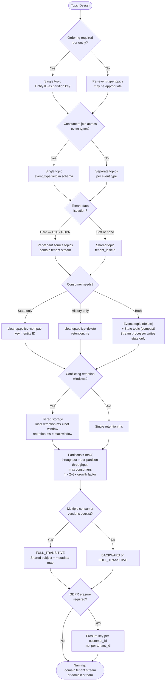

# Topic Design Framework

A decision path for designing Kafka topic topology from scratch. Work through the layers in order — each layer's answers constrain the next. Do not start with naming or partition counts before the structural questions are resolved.

The most common mistake is starting with implementation (how many topics, what names) before establishing the structural constraints that make those decisions unambiguous.

---

## Layer 1 — Structural Constraints (Answer These First)

These two questions gate every other decision. Getting them wrong at Layer 1 forces expensive rework at every subsequent layer.

### Q1: Do consumers need ordering for the same entity?

If yes: all events for the same entity (`order_id`, `user_id`, `payment_id`) must land on the same partition. This means **one topic with the entity ID as the partition key**.

One-topic-per-event-type breaks this: Kafka guarantees offset ordering within a partition, not across topics. Reconstructing order across topics requires timestamp-based joins — a fragile dependency on producer wall-clock accuracy across machines.

**Signal that ordering matters:** any consumer that needs to reconstruct a state machine (order lifecycle, payment lifecycle, user session) needs ordering.

### Q2: Do consumers need to join across event types for the same entity?

If yes: **single topic with an `event_type` field** in the schema, not one topic per event type. The consumer reads one topic and filters by `event_type` — offset ordering across event types is preserved for free.

If no (events are truly independent): separate topics per event type may be appropriate.

### Q3: Do tenants or clients need data isolation?

| Isolation requirement | Topology |
|---|---|
| Hard isolation (B2B, GDPR, per-client ACLs) | Per-tenant source topics: `{domain}.{tenant_id}.{stream}` |
| Soft isolation (filter by tenant_id in application) | Shared topic, application-level filtering |
| No isolation required | Single shared topic |

**Kafka ACLs are topic-level, not record-level.** If client A must not read client B's data, you need per-client topics — you cannot enforce record-level access control within a shared topic. Application-level filtering is only appropriate when the risk of a bug exposing cross-tenant data is acceptable.

**Fan-out from shared source is not a solution:** a shared source topic still contains all tenants' commingled data. The fan-out processor holds read access to everyone's data, and a routing bug has blast radius across all tenants. Use per-tenant source topics from the point of ingestion.

---

## Layer 2 — Retention and State

### Q4: What does each consumer need — current state, full history, or both?

| Consumer need | Topic config |
|---|---|
| Current state only | `cleanup.policy=compact`, key = entity ID |
| Full event history | `cleanup.policy=delete`, time-based `retention.ms` |
| Both | Two topics: events topic (delete) + derived state topic (compact) |

A single topic cannot serve both purposes cleanly. The events topic is the source of truth; the state topic is a derived view written by a stream processor.

**Who writes to the state topic:** always a stream processor reading from the events topic. Never the original producer dual-writing to both topics — if the events write succeeds and the state write fails, the two topics diverge.

### Q5: Do different consumers have conflicting retention requirements?

If consumers on the same topic need different retention windows (e.g., billing needs 7 years, dashboard needs 7 days), use Confluent Cloud tiered storage:

```
local.retention.ms  = <hot window>    # move to object storage after N days
retention.ms        = <max window>    # keep accessible for M years
```

The critical distinction: `retention.ms` controls how long data is accessible at all — from both local disk and object storage. Setting `retention.ms` to your short window while expecting tiered data to remain accessible is a misconfiguration; it will delete tiered data too.

Consumers use the standard Kafka consumer API regardless of whether data is on local disk or in object storage. See `02-Broker-Infrastructure/tiered-storage.md`.

---

## Layer 3 — Partition Count

### Q6: Size partitions for consumer parallelism, not throughput

**Formula:**
```
partitions = max(target_throughput / per_partition_throughput, expected_max_consumers)
```

For small-to-medium message sizes (< 10 KB), throughput rarely drives partition count beyond single digits. The binding constraint is almost always consumer parallelism ceiling: a consumer group can have at most one active consumer per partition.

**`expected_max_consumers` is scoped per consumer group, not summed across every team sharing the topic.** Multiple teams reading the same topic each run their own independent consumer group — each group gets its own full set of consumers up to the partition count, since group membership doesn't compete for partitions across groups. Size against the single group with the largest parallelism requirement, not the sum of every team's consumer count; summing overstates the requirement and over-provisions partitions for every other consumer of the same topic.

**Provision for growth upfront.** Increasing partitions after the topic has data breaks the `murmur2(key) mod N` mapping — existing messages stay in old partitions while new messages for the same key land in new partitions. A consumer must read multiple partitions to reconstruct full entity history. This is a semantic break, not an operational cost. It cannot be fixed without topic recreation and consumer replay.

Apply a growth multiplier (2–3×) to max expected consumer parallelism at scale, not to current needs.

See `02-Broker-Infrastructure/partitioning-strategies.md` for per-partition throughput benchmarks and hot partition diagnosis.

---

## Layer 4 — Schema and Governance

### Q7: How many Schema Registry subjects do you need?

**Default (TopicNameStrategy):** one subject per topic (`{topic-name}-value`). For per-tenant topics, this automatically gives per-tenant subjects. For shared topics, this gives one shared subject.

**Shared subject with a metadata map** is almost always better than per-tenant subjects when tenants need custom fields. A `metadata: map<string, string>` field absorbs optional custom enrichment without multiplying subjects. Per-tenant subjects create schema governance overhead at scale (100 tenants = 100 subjects to maintain independently).

**Compatibility mode:** use `FULL_TRANSITIVE` when multiple consumer groups at different versions must coexist on the same topic. This is the correct default for any shared infrastructure topic. See `08-Stream-Governance/schema-evolution.md`.

### Q8: What is the erasure key granularity?

GDPR right-to-erasure is scoped to the **data subject** (an individual person), not to the tenant. The crypto-shredding encryption key must be per-`customer_id`, not per-`client_id`.

A tenant-level key can only honor erasure by rotating the entire tenant's key — destroying all of that tenant's customers' data to honor one individual's request. See `08-Stream-Governance/pii-tracking.md`.

---

## Layer 5 — Naming Convention

A consistent naming convention makes ACL management, Schema Registry subject discovery, and consumer group naming deterministic. This is the canonical pattern for the guide — every other file that provisions or validates topic names (`10-Operational-Patterns/gitops-terraform.md`, `10-Operational-Patterns/platform-automation.md`, `10-Operational-Patterns/producer-onboarding.md`, `10-Operational-Patterns/opa-policy-enforcement.md`) should match it exactly, since the name drives ACL derivation and a non-compliant name breaks automation.

**The name must follow Layer 1's answer, not override it.** Whether `event-type` belongs in the topic name or in the schema is not a separate naming choice — it's already decided by Layer 1 Q1/Q2. Deciding the name first and the topology second is exactly the "start with implementation before structural questions" mistake this file opens by warning against.

**Recommended pattern:**

```
{domain}.{entity}.v{N}                                  # Layer 1 Q1/Q2 = yes (ordering/join
                                                          # required): ONE topic per entity,
                                                          # event_type is a SCHEMA FIELD, not a
                                                          # name segment — this is the default
                                                          # for any entity with a lifecycle
{domain}.{entity}.{event-type}.v{N}                      # Layer 1 Q2 = no (events are genuinely
                                                          # independent, nothing ever needs to
                                                          # read them as one ordered stream) —
                                                          # the exception, not the default
{domain}.{tenant_id}.{entity}.v{N}                       # per-tenant, hard isolation (Layer 1 Q3),
                                                          # same event_type-as-field rule applies
{domain}.{entity}.state.v{N}                             # compacted, current-state topic

payments.transaction.v1                  # transaction lifecycle (initiated/completed/failed/
                                          # reversed) needs ordering — ONE topic, event_type
                                          # is a field on each record, not four separate topics
customer.loyalty.earned.v1               # independent event with no sibling event types that
                                          # need joining or ordering against it — event-type
                                          # in the name is fine here
orders.acme-corp.shipment.v1             # per-tenant source event — hard isolation required
payments.transaction.state.v1            # shared compacted state topic (current balance, etc.)
```

Before using the `{event-type}`-in-name form, confirm the events genuinely never need cross-event ordering or joining for the same entity — a payment/order/session lifecycle almost always fails that test (see Layer 1 Q1's own examples), which is why `payments.transaction.v1` is the pattern's canonical example, not `payments.transaction.initiated.v1`. The tenant segment is inserted right after `domain` only when Layer 1 Q3 mandates hard isolation — don't carry it on shared topics, and don't drop it on isolated ones. `state` is a reserved literal in the entity-suffix position, not a form of `event-type`: it marks a compacted, latest-value topic the way `v{N}` marks a version.

**Conventions:**
- All lowercase, dot-separated segments
- Domain prefix matches bounded context, not team name
- Version the topic (`v{N}`), not the schema — a schema evolves via compatibility mode (`08-Stream-Governance/schema-evolution.md`); a topic version bump means a genuinely new, incompatible stream
- Avoid encoding partition count in the topic name — it changes, and isn't a semantic property of the stream
- **Environment is not part of the topic name** — the standard model is one Confluent Cloud environment/cluster per tier (dev/staging/prod), so the Terraform workspace or cluster context already signals environment to CI; embedding it in the name would be redundant. See `10-Operational-Patterns/opa-policy-enforcement.md` for how the CI policy gets environment context without it.

---

## Anti-Pattern Checklist

Before finalising a topic design, verify none of these apply:

| Anti-pattern | Signal | Fix |
|---|---|---|
| One topic per event type for a stateful entity | Consumers join across topics to reconstruct state | Single topic with `event_type` field, keyed by entity ID |
| Shared source topic for B2B tenants | ACL cannot enforce per-tenant read isolation | Per-tenant source topics from ingestion |
| Fan-out from shared source for isolation | Shared source still has commingled PII | Eliminate shared source; route at write time |
| `retention.ms` = short window with tiered storage | Long-retention consumers lose data after short window | `local.retention.ms` = short, `retention.ms` = long |
| Producer dual-writes to events + state topic | Inconsistency on partial failure | Stream processor writes to state topic only |
| Erasure key at tenant granularity | Cannot honor individual GDPR erasure | Erasure key per data subject (`customer_id`) |
| Partition count sized to current throughput only | Must recreate topic when consumers scale | Apply 2–3× growth multiplier to max consumer parallelism |
| "Increasing partitions is expensive" | Frames it as a cost problem | Frame correctly: ordering breaks on key remapping |

---

## Decision Sequence Summary



---

## Cross-References

- `02-Broker-Infrastructure/partitioning-strategies.md` — partition sizing, key-based ordering, compaction vs retention, partition increase semantics
- `02-Broker-Infrastructure/tiered-storage.md` — `local.retention.ms` vs `retention.ms`, Confluent Cloud tiered storage
- `08-Stream-Governance/schema-evolution.md` — FULL_TRANSITIVE compatibility, multi-consumer schema coexistence
- `08-Stream-Governance/pii-tracking.md` — crypto-shredding, per-data-subject erasure key design
- `09-Security-Architecture/rbac.md` — per-topic ACL patterns for multi-tenant deployments
- `10-Operational-Patterns/blue-green-topic-migration.md` — safe procedure for partition count changes on live topics
- `14-Case-Studies/logistics-order-tracking.md` — worked example: B2B logistics platform topic design
- `14-Case-Studies/fintech-fraud-detection.md` — worked example: multi-topic pipeline, PCI partition key constraints
